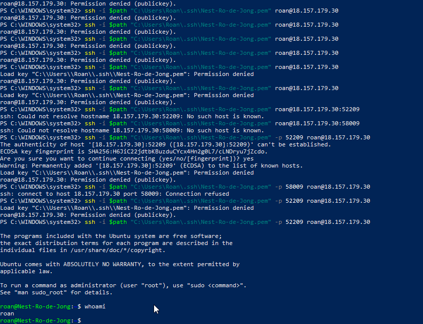

# SSH Remote connection
The assignment was to connect to a virtual machine in the cloud with Secure Shell Protocol via a command line interface. Secure Shell is a networking protocol that allows for encrypted communication between two computers. It's typically used to operate another machine remotely. Linux and OS X offer native support for SSH, and Windows 10 offers access via an advanced settings menu or a client program.

## Key-terms
#### SSH
* Secure Shell Protocol. A networking protocol used for accessing another computer remotely.*
#### CLI
* Command Line Interface. A text-based user interface that allows a user to operate a computer with keyboard commands.
#### VM
* Virtual Machine. A software rendition of a physical computer, with multiple VMs frequently running on one physical machine in the cloud. Can be used in all the ways that a typical computer can.

## Opdracht
### Gebruikte bronnen
https://superuser.com/questions/1296024/windows-ssh-permissions-for-private-key-are-too-open  
https://www.vmware.com/topics/glossary/content/virtual-machine.html  
https://www.techtarget.com/searchwindowsserver/definition/command-line-interface-CLI  
https://www.ssh.com/academy/ssh/protocol

### Ervaren problemen
* Ran into a permission denied: public key issue. Solved via comprehensive googling and by mucking about in file permissions on Windows 10.
* Ran into an issue with connecting to the right port number via OpenSSH. Solved via google & with help from a teammate.

### Resultaat
I succeeded in using the whoami command to log into the Virtual Machine via Windows Powershell. 
