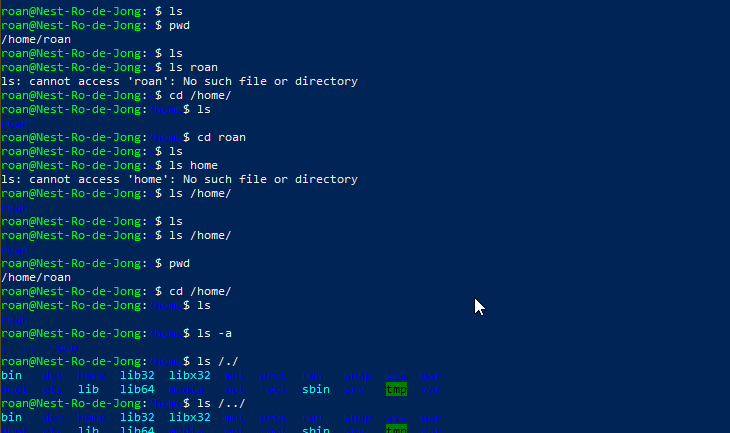
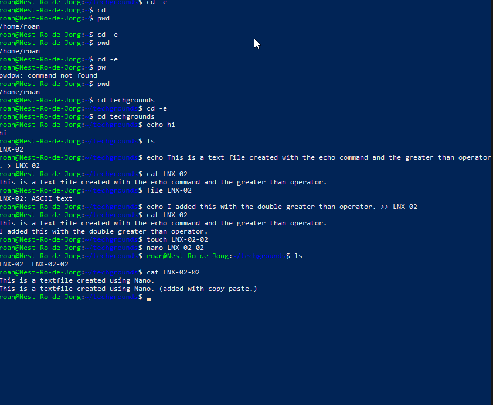

# Files and Directories
An introduction to the basics of the Linux filesystem. The assignment involves learning how to navigate Linux via CLI and creating files and folder. This requires knowledge of a few key commands, seen below.

## Key-terms
##### ls
Lists files in the current directory. Can be modified or directed to list files in another directory. For example `ls -a` to list hidden files or `ls /home/../bin/` to list files in another directory.

##### pwd
Print working directory. Displays the directory the user is currently in.

##### cd
Change directory. Can be used relatively `cd techgrounds` or in absolute terms `cd /home/roan/techgrounds/`.

##### cat
Concatenate. Displays the contents of a file.

##### echo
Echoes a message back to the user via CLI.

##### mkdir
Make directory. Creates a directory. Can be used relatively or in absolute terms.

##### nano
Opens a text editor, **nano**, which allows the user to create and edit text.

##### Shell Operators
Shell operators modify commands. 
* &: Allows the user to run commands in the background.
* &&: Allows for the combination of multiple commands on one line in the terminal (CLI.)
* \>: Redirects the output from one command somewhere else. For example, `echo hello > welcome` creates or overwrites the file *welcome* with the content *hello*.
* \>\>: Does the same as above, but appends the output to the end of the redirected file instead of overwriting it.

##### Arguments
Arguments allow you to modify commands. One useful modifier is --help. For example `ls --help` lists all possible modifiers for the **ls** command.

##### man
The manual page. Can be used to display documentation for a specific command. For example `man ls` will display all relevant info for the **ls** command.

## Opdracht
### Gebruikte bronnen
https://tryhackme.com/room/linuxfundamentalspart1  
https://tryhackme.com/room/linuxfundamentalspart2  
https://tryhackme.com/room/linuxfundamentalspart3

### Ervaren problemen
* The assignment was written for another Linux distribution. Solved via communication with LC.
* Log-in issues due to bad permissions on my local keyfile. Fixed by changing permissions again. Presume permanently solved.

### Resultaat
I (re)learned the key Linux commands and completed the assignments. I created a new directory in `/home/roan/` named *techgrounds*. I followed this by creating two text files, *LNX-02* and *LNX-02-02*. The first I created by using `echo text > filename` and the second by means of the **nano** text editor.

I had previously completed the Linux fundamentals course on [tryhackme](https://tryhackme.com) and used my active subscription to refresh my memory of the commands. Screenshots below.

