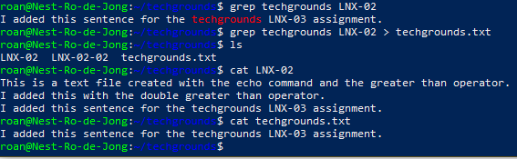

# Working with text (CLI)
The basics of working with text files in Linux via the CLI. Using the **grep**, **echo**, **cat** commands and the **\>** operator it's possible to create, search and read text files. 

#IT/Linux 

## Key-terms
##### cat
Concatenate. Displays the contents of a file.

##### echo
Echoes a message back to the user via CLI.

##### grep
Global regular expression print. Finds a specific expression (a word or line) and prints it to the CLI. For example, can be used to find all lines with the word *techgrounds* in a text file.

##### Shell Operators
Shell operators modify commands. 
* &: Allows the user to run commands in the background.
* &&: Allows for the combination of multiple commands on one line in the terminal (CLI.)
* \>: Redirects the output from one command somewhere else. For example, `echo hello > welcome` creates or overwrites the file *welcome* with the content *hello*.
* \>\>: Does the same as above, but appends the output to the end of the redirected file instead of overwriting it.

##### stdin
Standard input. The keyboard. Recognised by the CLI as the **-** argument.

##### stdout
Standard output. What the OS outputs via the terminal (a CLI.)

## Opdracht
### Gebruikte bronnen
https://tryhackme.com/room/linuxfundamentalspart1  
https://tryhackme.com/room/linuxfundamentalspart2  
https://www.javatpoint.com/linux-commands  

### Ervaren problemen
* At first I tried to use the **cat** command by means of `cat LNX-02 - LNX-02-02` and I had to google how to exit the *stdin* (keyboard input) prompt. Ctrl+D.
* I couldn't recall the command to search a file, so I googled a list of common Linux commands (listed above) to find **grep**.

### Resultaat
I used the LNX-02 textfile as a base and appended it with the **\>\>** operator to add a line about techgrounds. I followed this by using **grep** to find the line and then used the **\>** operator to redirect it to a new file called *techgrounds.txt*.
