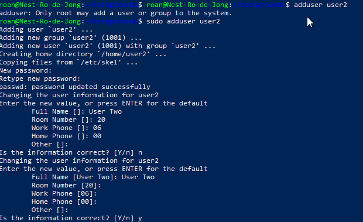

# Users and groups
Users are accounts or processes on a Linux machine. There are two types: system users are created by the system, such as *daemon*; these are processes that run without end-user intervention. User accounts are created by *root* or another user with administrative permissions.

Groups are a cluster of users. They simplify managing permissions for multiple users.

## Key-terms
##### sudo
Super User Do. Allows the user to execute commands they would not normally be able to. Example: `sudo adduser user2`

##### adduser
The command to create a new user. Requires admin (or sudo) permissions.

##### usermod
The command to add a user to a group.

##### su
Switch user. Switches to another user. Will prompt for a password if there is one.

##### -a
Append. In the context of this assignment, it adds the user to the groups listed by **-G** without removing them from other groups.

##### -G
Supplementary groups the user is also part of.

## Opdracht
### Gebruikte bronnen
https://www.javatpoint.com/linux-add-user-to-group
https://www.digitalocean.com/community/tutorials/how-to-create-a-new-sudo-enabled-user-on-ubuntu-22-04-quickstart  
https://phoenixnap.com/kb/how-to-list-users-linux#:~:text=Linux%20stores%20information%20about%20local,directory%2C%20and%20the%20login%20shell.  
https://www.ibm.com/docs/en/ibm-mq/9.1?topic=windows-creating-managing-groups-linux  
https://linuxize.com/post/how-to-add-user-to-group-in-linux/  
https://phoenixnap.com/kb/how-to-list-users-linux#:~:text=Linux%2Dbased%20systems%20have%20two,root%2C%20which%20possesses%20administrative%20privileges  

### Ervaren problemen
* While completing the assignment was easy with some googling, I struggled to define **-G** for this report. I solved this by looking at the manual file for the **usermod** command.  

### Resultaat
I successfully used the `sudo adduser` command to create a new user. I switched to this user and found the files *group* and *passwd* in the */etc/* folder.

  
  
