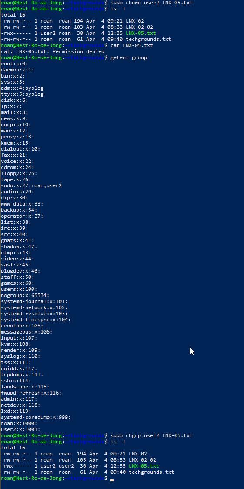

# File permissions
File permissions in Linux determine who can access (read), change (write) and use (execute) certain files. The administrator account, root, has access to everything without requiring permissions.

Permissions are split into three categories: user, user group and other. The OS identifies which of these categories a user trying to access the file belongs to and lends the correct permissions.

## Key-terms
##### rwx
Read, write, execute. A user with **rwx** permissions for a file can read, write and execute it.

##### -l
An option for the **ls** command. It displays information in a long list format, showing much more detail.

##### chmod
Change mode. This command changes the file permissions for a file using octal values.

##### Octal number system
A numeral system, used in this context to set file permissions. Supplanted in most modern computing by the hexadecimal system.

Read is defined by the number 4. Write by 2. Execute 1. Added together (as 4, 6 or 7) in a 3 digit number signifies which user has permissions. The first digit represents the owner, the second the owner group, and the third other users. An example below:
	chmod 764 LNX-05.txt
changes the permissions for the file LNX-05.txt so that the owner can read, write and execute. The group owner can read and write. Other users can only read.

##### chown
Changes the owner of a file.

##### chgrp
Changes the group owner of a file.

## Opdracht
### Gebruikte bronnen
https://www.hackerearth.com/practice/notes/Virendra/linux-commands-using-chmod/#:~:text=rwx%20means%20that%20this%20user,but%20cannot%20write%20to%20it.  
https://www.redhat.com/sysadmin/linux-file-permissions-explained

### Ervaren problemen
* I identified the issues with the assignment as follows:
	* I didn't know how to change file permissions in Linux.
		* Upon finding a useful source in google, I quickly solved the assignment but had to define octal numbers in my own words. I read a little further and decided to instead write out how I solved  the assignment, thereby showing an example for future reference.
	* I didn't know how to change owners or group owners in Linux.
		* Using the same source as above and the knowledge picked up over the course of the previous assignments, I quickly found the required commands.

### Resultaat
I created a text file using the **echo** command and the **\>** operator. Using `ls -l` I displayed a long-form listing that showed file permissions. With **chmod**, **chown** and **chgrp** I then changed permissions to complete the assignment.

