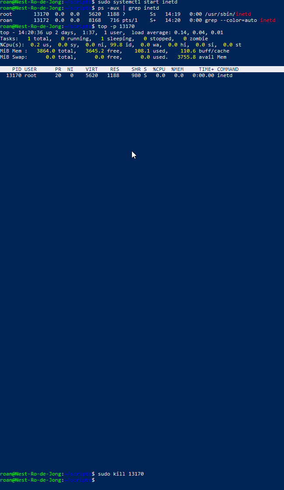
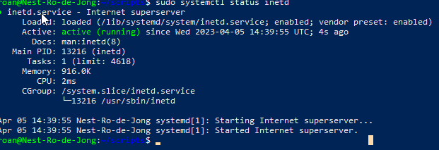

# Processes
Processes are programs that are actively executing. They are identified in the terminal by a name, such as *sshd* and a PID, such as *258*. There are multiple kinds of processes in Linux, including user processes, daemon processes and kernel processes. User processes are initiated by the user. Daemon processes  run in the background as services. Kernel processes run in the kernel, and cannot be modified on the fly.

#IT/Linux

## Key-terms
##### apt
A utility that manages packages in Linux distributions. Used for installing, updating and uninstalling packages such as *telnetd* and *apache2*.

##### daemon
A daemon is a background process that runs automatically and does not print information to the console in any way.

##### systemctl
Systemctl is a command that manages the *systemd* initialisation system. It can start and stop services, as well as enabling or disabling them from running at boot.

##### PID
Process ID. A numerical value assigned to a process.

##### ps
Lists the user's currently running processes. Used with the **-aux** flag, it displays all active processes, including system processes and those belonging to other users.

##### top
A command that displays real-time usage statistics on running processes. Includes memory & CPU utilization. Using the **-p** flag as `top -p PID` displays detailed information on a process.

##### kill
Kills or ends a process.

## Opdracht
### Gebruikte bronnen
https://tryhackme.com/room/linuxfundamentalspart3  
https://adamtheautomator.com/linux-to-install-telnet/  
https://linuxize.com/post/how-to-use-apt-command/  
https://access.redhat.com/sites/default/files/attachments/processstates_20120831.pdf  
https://www.digitalocean.com/community/tutorials/how-to-use-systemctl-to-manage-systemd-services-and-units

### Ervaren problemen
* How to start a process? 
	* How to find a process ID?
		* I used the Linux Fundamentals Course on tryhackme to find the **top** command.
	* How to find the memory usage of a process?
		* I read part of the manual file on **top** and followed this by trying the **-p** flag.
	* How to kill a process?
		* I used the same source as above.
* One issue my entire team ran into was initialising the telnet daemon. We downloaded the required files, but any attempt to start the service failed. Upon learning about virtual packages in LNX-07, it became clear the *inetd* process was the one we needed to start and stop.

### Resultaat
I successfully started the *inetd* process and found its *PID* via the `ps -aux | grep inetd` command. With the command `top -p PID` I found its relative memory usage, and with `systemctl status inetd` its absolute usage. I finished by using the *kill* command, though `systemctl stop inetd` would likely have worked too.

  

