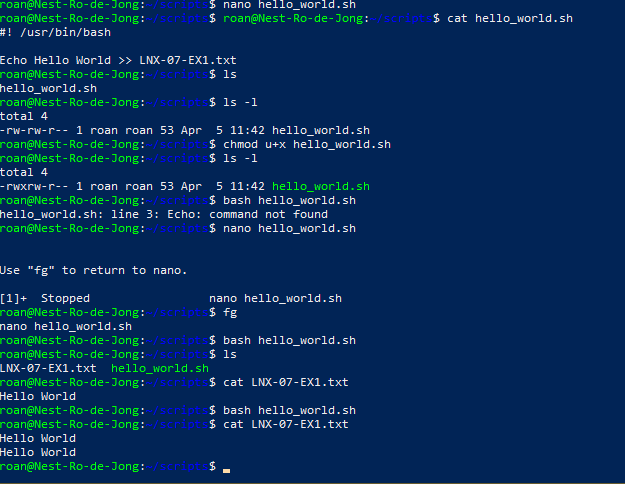
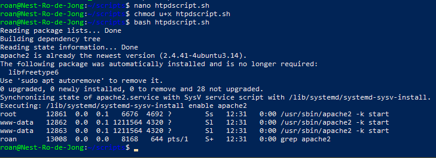
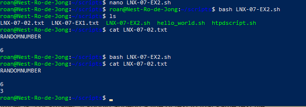
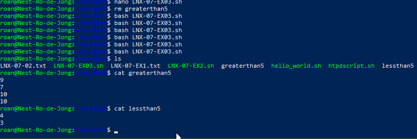

# Bash scripting
Bash is a command language and shell. Via a command line interface, it processes commands and executes them. Via scripting, it's possible to run multiple commands at once in sequence.

## Key-terms
##### PATH
Allows the user to run command-line programs from directories other than the current working directory. Adding a new directory works as follows: `export PATH=/this/way/to/file:$PATH` to prioritise it. `export PATH=$PATH:/thisway/to/file` adds it to the end of the list of checked directories instead. This lasts until the end of the current shell session. To permanently add the directory, it requires a change in the shell configuration file, typically found at `~/.bashrc`.

##### bash
A command language and shell. It can read the bash scripting language and execute the commands it reads. 

##### script
A file with a list of commands. With a command language interpreter such as **bash**, it's possible to read and execute these commands.

##### shebang
The `#!` symbols in sequence to signify the beginning of a script. This is followed by a path to the program that interprets the scripting language used. In **bash**, this is typically seen as `#! /usr/bin/bash`

##### shell
A macro processor used to execute commands. It interprets commands and can be used to program, allowing users to write their own commands. 

##### virtual package
A function such as **httpd** that can be provided by multiple different types of software packages. For example, *apache2* will function as a **httpd** webserver.

## Opdracht
### Gebruikte bronnen
https://www.digitalocean.com/community/tutorials/how-to-view-and-update-the-linux-path-environment-variable  
https://www.freecodecamp.org/news/shell-scripting-crash-course-how-to-write-bash-scripts-in-linux/  
https://askubuntu.com/questions/652326/whats-a-virtual-package  
https://www.tutorialspoint.com/guide-to-generate-random-numbers-in-linux  
https://tldp.org/LDP/abs/html/comparison-ops.html  
https://ryanstutorials.net/bash-scripting-tutorial/bash-if-statements.php

### Ervaren problemen
* What is PATH?
	* How do I use it?  
	I solved this by googling PATH and reading about its function and syntax.

* Create a script that appends a line of text to a text file whenever it is executed.
	* How do I create a script?
		* How do I create a script with the required functionality?  
	I followed the instructions on [this site](https://www.freecodecamp.org/news/shell-scripting-crash-course-how-to-write-bash-scripts-in-linux/) to learn the **shebang** command and adjusted the tutorial using my knowledge of **echo** and **\>\>**. 

* Create a script that installs the httpd package, activates httpd, and enables httpd. Finally, your script should print the status of httpd in the terminal.
	* What is httpd?
		* How do I install it?
			* sudo apt install apache2
		* How do I activate it?
			* sudo systemctl start apache2
		* How do I enable it?
			* sudo systemctl enable apache2
		* How do I print it?
			* ps -aux | grep apache2  
	I solved this issue by learning about *virtual packages* and my existing knowledge about installing apache2 from a previous course.

* Create a script that generates a random number between 1 and 10, stores it in a variable, and then appends the number to a text file.
	* How do I generate a random number?
		* How do I store this number in a variable?  
	I solved this by googling variables & the creation of random numbers in Linux. I ran into an issue where my variable `RANDOM=$((RANDOM10+1))` was recognised as a request for a random number by the **echo** command. I fixed it by appending another letter to the end of the variable.

### Resultaat
I created four different scripts, three of which I uploaded: [exercise 01-02](../LNX-07/LNX-07-EX1), [exercise 02](../LNX-07/LNX-07-EX2) and [exercise 03](../LNX-07/LNX-07-EX3). The first, not uploaded, appends a line of text to a new file upon execution. The second installs, starts, enables and displays the status of the appache2 webserver; a package that falls under the *virtual package* umbrella of *httpd*. The third and fourth show my progression with variables, random numbers and basic conditional scripting.

  
  
  

