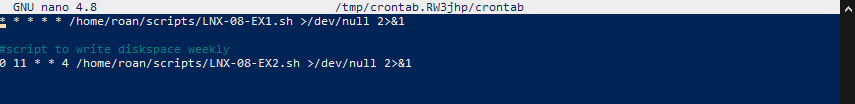
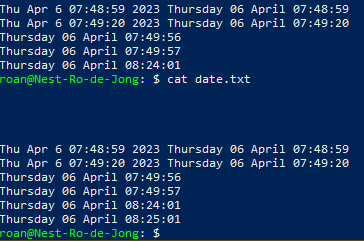
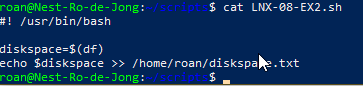

# Cron jobs
Cron jobs allow the user to run tasks and processes on a schedule. In combination with scripting, this allows for significant automation of otherwise monotonous tasks. 

## Key-terms
##### cron
Cron is a *daemon* used to schedule tasks to be executed at a specific time and date.

##### crontab
Crontab is a command used to create a table of commands, that the *cron* daemon uses to execute these commands at a specific time.

##### devnull
A folder `/dev/null` where files are automatically discarded. By routing the stdoutput and stderr here from crontab, the OS does not create any logs or display anything to the terminal when the scripts run.

##### stderr
Standard error. Used by processes to write an error message.

##### fg
A command to print the currently available diskspace.

##### date
A command to print the current date and time.

## Opdracht
### Gebruikte bronnen
https://tryhackme.com/room/linuxfundamentalspart3  
https://crontab.guru/  
https://crontab-generator.org/  
https://www.howtogeek.com/410442/how-to-display-the-date-and-time-in-the-linux-terminal-and-use-it-in-bash-scripts/  
https://www.cyberciti.biz/tips/shell-script-to-watch-the-disk-space.html  
https://www.techtarget.com/searchdatacenter/definition/crontab  
https://unix.stackexchange.com/questions/89386/what-is-symbol-and-in-unix-linux

### Ervaren problemen
* What is the function to print the current date and time?
* How do I register a script in crontab?
	* How do I make it run every minute?
* What is the function to display currently available disk space?
	* How do I make it run weekly?  
I solved my issues by first googling the commands or syntax I didn't recognise. I then wrote the required scripts and edited my crontab.

### Resultaat
I successfully wrote a script that appends the current date and time to a text file. Another script appends the used diskspace to a text file. Using [crontab guru](https://crontab.guru) and [crontab generator](https://crontab-generator.org) I wrote the required lines and pasted them into crontab.

  
  
