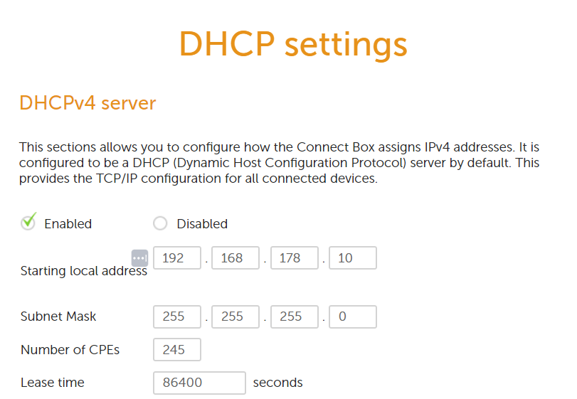

#Networking #OSI

# Network Devices
Networking devices serve to connect networks or devices together. There are many different types of devices, each with unique functions. Some can connect together different LANs, others simply refresh a signal so that it is still readable once it reaches its end destination. Networking devices are the backbone of any home, office or global network.

## Key-terms
### Common network devices
#### Repeater
A repeater is tasked with copying a weakening signal and retransmitting it at full strength over the same network. It is not an amplifier; it does not increase the strength of the signal. A repeater is a device with two ports and functions on the physical layer.

#### Hub
A hub is in essence a repeater with more than two ports. It connects multiple  devices on the same network and retransmits signals it receives to all connected devices. It does not discriminate between devices; meaning data it sends to one device it sends to all. It operates on the physical layer.

#### Bridge
A bridge is similar in function a repeater, but is capable of reading the #MAC addresses of the devices on both ends of a signal. They can also be used to connect two LANs that function on the same networking protocols. It is a two port device, and because of its ability to read MAC addresses is a data link layer device.

#### Switch
A switch is more complicated and efficient than the devices named above. Unlike a bridge, it has multiple ports and boasts features that improve performance. It is capable of checking packets for errors before forwarding them to the correct destination. Switches exist with many different kinds of functions, including:
* Managed switches, which offer many more configuration options like VLANs. They're ideal for bigger, more complicated networks.
* Smart switches, which feature capabilities not dissimilar to managed switches. Typically they're easier to configure and suited to medium-sized networks.
* Unmanaged switches, which are ideal for small networks.

#### Router
A router is primarily a network layer device, and used to connect a LAN (Local Area Network) to a WAN (Wide Area Network), such as the internet. As their name indicates, routers are responsible for routing data. They have a variety of different configuration options and advanced features, such as firewalls and traffic control.

#### Modem
A modem is a digital-to-analog signal converter that converts digital signals for transfer over analog phone lines. They are a physical and data link layer device, and are typically provided by DSL and cable internet providers.

#### Gateway
Gateways are a more advanced type of router, designed to connect multiple networks that each use distinct protocols and domain name services. A protocol converter serves as the translater between these different networks, and a router that has this function can also be called a gateway.

#### Access Point
Access points are data link devices, and are usually used in conjunction with a wireless connection. It can serve as a connector between a wired network and wireless devices, or a router that transmits data from one AP to another. 

#### NIC
A network interface card is an adapter that connects a machine to the network. With a unique #MAC address, it serves as a data link layer device.

### Other terms
#### DHCP
Dynamic Host Configuration Protocol gives IP addresses to new devices on the network. It allows for automatic configuration of basic networking settings.

#### Subnet Mask
A subnet mask is used to designate subnetworks for a LAN. It divides an IP address into a a host address and a network address and can determine how many devices are allowed on the subnet.

#### CPEs
Customer Premise Equipment is any device connected to the network or internet.

#### Lease time
The amount of time an IP address can be leased to a device. The IP address is reserved for the duration and can be renewed via contact with the DHCP server.

## Opdracht
### Gebruikte bronnen
[List of commonly used networking devices.](https://www.geeksforgeeks.org/network-devices-hub-repeater-bridge-switch-router-gateways/)  
[Alt. source for networking devices.](https://blog.netwrix.com/2019/01/08/network-devices-explained/)  
[Info about networking topologies and subnetting](https://tryhackme.com/room/introtolan)  
[DHCP]([)https://www.techopedia.com/definition/11337/dynamic-host-configuration-protocol-dhcp)  
[Subnet Mask](https://www.techopedia.com/definition/5563/subnet-mask)
[CPEs](https://www.promptlink.com/media-library/blog/what-is-cpe-and-why-does-it-matter.html)  
[Lease Time](https://lazyadmin.nl/home-network/dhcp-lease-time/)

### Ervaren problemen
* Create a list of common network devices and describe their functions.
	* Search for common network devices.
		* Read articles describing their functions and write notes.  
* Log in on router and find a list of connected devices.
	* Explore the router's menu to find what other information it stores on connected devices.
* What are the DHCP settings on my network?
	* Solved by logging into the router, examining the relevant settings and then finding what they're responsible for.

### Resultaat
By combing the internet for information about networking devices and combining this with my layman's knowledge of the subject, I was able to put together a list of common devices and their uses. Furthermore, I explored my router's settings.  
  
The above shows a list of connected devices. Below a screenshot of the DHCP settings, with explanations listed under the header Key Terms above.  
