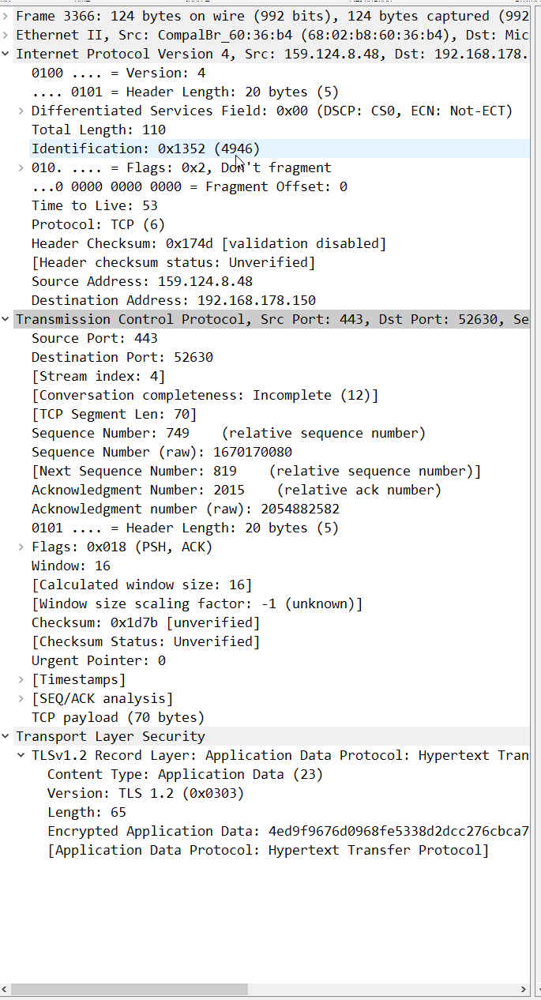

# Protocols
Protocols are the agreed upon standards on which networking and the internet function. They establish guidelines and common language which can then be adopted by manufacturers and users worldwide. The IETF is the guiding body that ratifies these standards after they have undergone significant testing and iteration.

#Networking #Protocols #OSI #TCP/IP #Wireshark

## Key-terms
### Protocols
See the [OSI report](NTW-01_report_OSI.md) for more detailed info about the OSI model and how these protocols fit into its framework.

#### Application Layer
##### DNS
Domain Name System. A protocol that assigns domain names (website URLs) to IP addresses.

##### HTTP
Hypertext Transfer Protocol. A protocol that serves as the bedrock for the World Wide Web.

#### Presentation Layer
##### TLS
Transport Layer Security, or TLS, is a protocol that secures communication over a network. Typically used in e-mail, VoIP and HTTPS.

##### SSL
Secure Sockets Layer allows for the creation of an encrypted connection between a server and a client. For example, a web server and a browser. It has been superseded by by the TLS protocol in many scenarios.

#### Session Layer
##### SAP
Session Announcement Protocol. A protocol used for multicast session information, where one device sends information to a multitude of different machines. 

##### L2TP
Layer Two Tunneling Protocol. This protocol is used by VPNs to provide encryption of a handshake message.

#### Transport Layer
##### #TCP
The Transmission Control Protocol allows for communication over the internet. It's designed to create a connection that lasts until all data has been transmitted. Furthermore, the protocol safeguards against data corruption by checking for errors. It is commonly used for browsing the internet and file sharing, due to its accurate nature. An example of the TCP three-way handshake that is used to establish a stable connection below:
* The client sends a request to **SYN**chronise with the server.
* The server responds with a **SYN**chronise and **ACK**nowledge message.
* The client **ACK**knowledges this.

##### #UDP
The User Datagram Protocol is designed for a faster transfer of data. By not synchronising the connection between two devices or checking the received data for errors, it trades accuracy for efficiency. This is useful for activities that require large amounts of data to be sent where some corruption is unimportant, such as video streaming.

#### Network Layer
##### IPv4
Internet Protocol version 4. Superseded by IPv6, but still extremely popular. It provides a logical connection between devices on a network by assigning an identity to each device (an #IP address.)

##### RIP
Routing Information Protocol is used to determine the best route for end-to-end traffic. With a metric/hop count algorithm it determines the shortest possible path, which allows data to be delivered as quickly as possible.

#### Data Link Layer
##### ARP
The Address Resolution Protocol translates network layer addresses (such as an IP address) into link layer addresses (such as a MAC address.)

#### Physical Layer
##### Bluetooth
Bluetooth is a wireless communication protocol used over short distances. Used on a variety of devices, including laptops, phones and wireless earbuds.

### Other Terms
#### IETF
The Internet Engineering Task Force was founded in 1986 and is responsible for the development of new standards and protocols used for the internet, networks and relevant devices.

#### IETF Standards Process
The IETF standards process mandates how a new standard is created and adopted. In essence, it is the development of a new specification that is then iterated upon by the wider internet community. Upon a sufficient amount of iteration that proves its feasibility, it is then adopted as a Standard.

The key benchmarks a Standard needs to achieve adoption include:
* Technical distinction
* A history of implementation and sufficient testing
* Qualitative documentation
* An open, fair and timely nature

#### RFCs
A request for comment; a document that contains technical specifications and notes on a topic related to the IETF. These typically begin their life as internet drafts created by an individual or smal group and become RFCs upon wider adoption.

#### Wireshark
Wireshark is a program that analyses network protocols. It can sniff packets on a network connection. Common uses include troubleshooting network issues, analysing vulnerabilities and debugging.

## Opdracht
### Gebruikte bronnen
[Wireshark documentation](https://www.wireshark.org/docs/wsug_html/)  
[Internet Engineering Task Force](https://www.ietf.org/)  
[IETF process for developing a new standard](https://www.ietf.org/standards/process/)  
[Information about packets and TCP](https://tryhackme.com/room/packetsframes)
[Observation of TCP in wireshark](https://www.youtube.com/watch?v=3Zb_EebU22o)
[SAP](https://www.techopedia.com/definition/25846/session-announcement-protocol-sap)  
[L2TP](https://www.techtarget.com/searchnetworking/definition/Layer-Two-Tunneling-Protocol-L2TP)  
[PDU](https://www.techopedia.com/definition/25292/protocol-data-unit-pdu)  
[IPv4](https://www.techopedia.com/definition/5367/internet-protocol-version-4-ipv4)  
[RIP](https://www.techopedia.com/definition/24846/routing-information-protocol-rip)  
[ARP](https://www.techopedia.com/definition/5493/address-resolution-protocol-arp)  
[PON](https://www.techopedia.com/definition/16009/passive-optical-network-pon)  
[Bluetooth](https://www.techopedia.com/definition/26198/bluetooth)  
[API](https://www.techopedia.com/definition/24407/application-programming-interface-api))  

### Ervaren problemen
* Identify several other protocols and their associated OSI layer. Name at least one for each layer.
	* I read ahead before starting work on the NTW-01 assignment and decided to research and note relevant protocols while reading about the OSI and TCP/IP models.
* Figure out who determines what protocols we use and what is needed to introduce your own protocol.
	* I will use google to find the relevant authority and then read about the process on their website.
* Look into wireshark and install this program. Try and capture a bit of your own network data. Search for a protocol you know and try to understand how it functions.
	* I will install wireshark and experiment with its functions before diving into the documentation to build a broader understanding of the program.

### Resultaat
Via research I established a foundation of knowledge for learning more about protocols. With Wireshark, I was able to capture my network data and analyse the process.

In the screenshot below one can see the transformation of a #PDU as it travels the layers of the #OSI model. A frame on the data link layer, it then adopts ethernet and IPv4 protocols on the network layer and #TCP on the transport layer. Finally, TLS encryption is added, obfuscating the data being transmitted via HTTP.

The Total Length listed under the IPv4 Protocol header refers to the byte size of the packet. Time to live defines the expiry date of the packet if it fails to reach its destination. The checksum allows for error-checking; any change in this sequence indicates data loss or corruption.

Under the TCP header, one can see the source and destination ports. The Sequence Number and Acknowledgement Numbers are one part of the three-way handshake briefly described under #TCP, specifically the second step.

Finally, under the TLS header, information about the encrypted data can be found. Its type, protocol and size are all listed.

