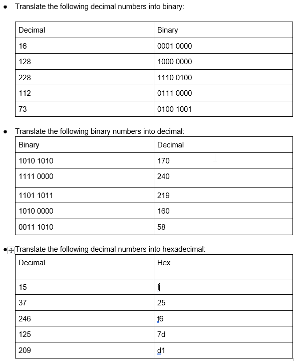
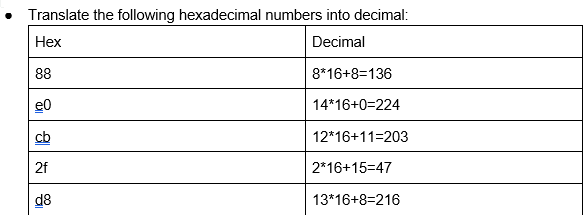

# Counting in Binary and Hex
Binary and hexadecimal are two alternative numeral systems to the commonly used denary (base-10) system. Binary is commonly used in computing, given that it accurately translates to the state of the many transistors on a chip: they can be on, or off. Hexadecimal on the other hand is due to its nature as a base-16 system much more compact than either denary or binary systems, and is therefore an efficient way of storing and transmitting data.

#Binary #Hexadecimal

## Key-terms
#### Binary system
In simple terms, binary is a numeral system that consists of two figures: 0 and 1, on and off. Using sequences of these two states, it is possible to create variations that represent higher numbers. In computing, these are referred to as bytes, consisting of 8 bits (binary numerals.) The first number represents 1, the second 2, the third 4, the fourth 8, and so on. With different combinations of on/off states, one can count from 0 to 255 with a single byte. For example, 00001001 represents the number 9. By combining bytes, one can count even higher.

One comprehensible way to consider the binary system is that each digit represents 2 to the power of. For example, as 1111 consists of:
    2 to the power of 3 = 8
    2 to the power of 2 = 4
    2 to the power of 1 = 2
    2 to the power of 0 = 1  
Added together, this is equivalent to the number 15 in denary (another name for base-10.)

#### Hexadecimal system
The hexadecimal system is a numeral system with 16 digits. It uses the 10 digits from the base-10 system (0-9), but also the first 6 letters of the alphabet (A, B, C, D, E and F) which represent numbers 10 to 15. Each figure in a sequence represents 16 to the power of. As an example:

A9 represents A(10) multiplied by 16 to the power of 1, followed by 9 multiplied by 16 to the power of 0. Effectively, 169 in denary.

## Opdracht
### Gebruikte bronnen
[Counting in Binary, Harvard CS50 2022](https://youtu.be/IDDmrzzB14M?t=989)  
[Hexadecimals, Khan Academy](https://www.youtube.com/watch?v=4EJay-6Bioo)  
[Converting decimals to hexadecimal.](https://www.tutorialspoint.com/how-to-convert-decimal-to-hexadecimal)  
[Uses of hexadecimal](https://www.techtarget.com/whatis/definition/hexadecimal)

### Ervaren problemen
Tasked with understanding the binary and hexadecimal systems, I decided to seek out visual sources of information that could relay the subjects in an easily digestible manner. I ran into only one roadblock, converting decimal to hexadecimal, but a quick google search and brushing up on my mathematics solved the issue.

### Resultaat
I used addition to solve the binary-decimal and decimal-binary conversions. For hexadecimal to decimal I used a simple formula, visible in the screenshots. For decimal to hexadecimal I divided the number by 16 to produce a quotient and used the remainder to note the second figure.

