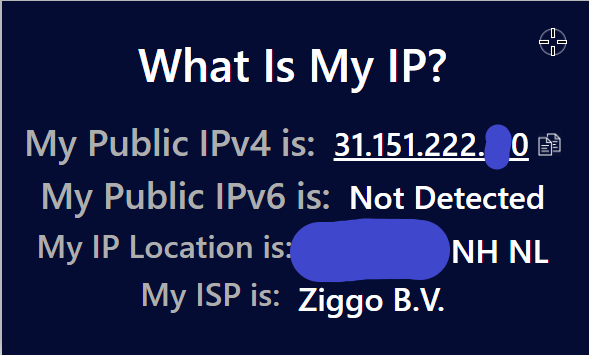
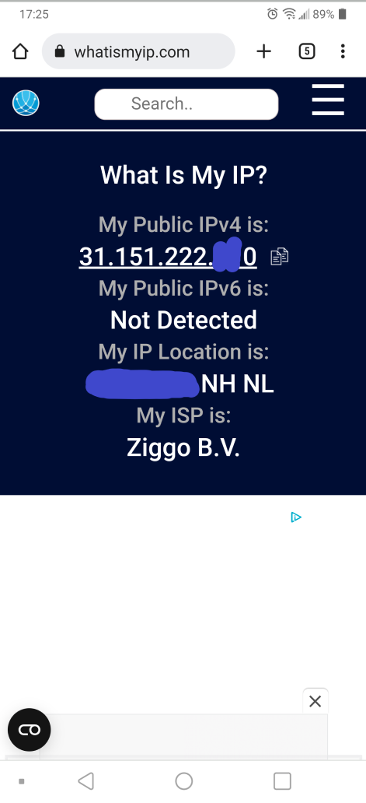
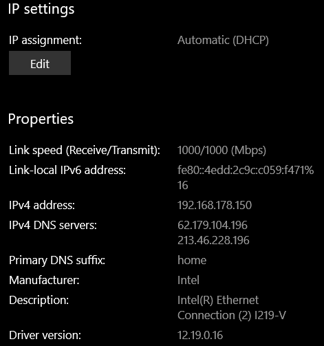
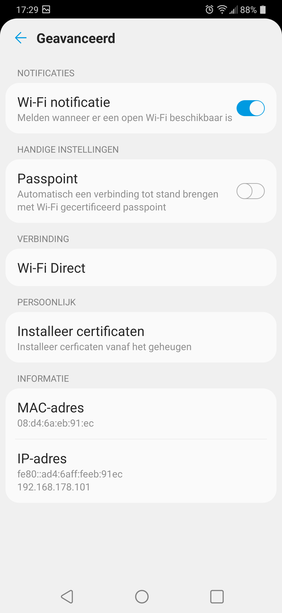
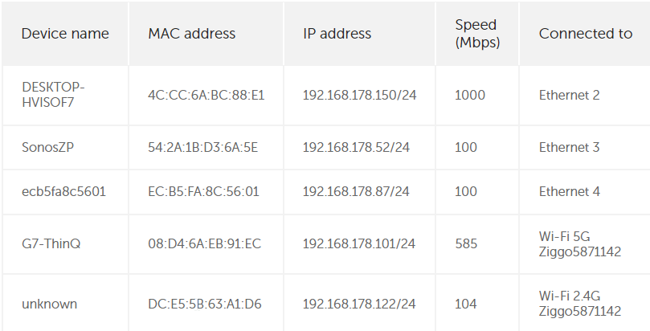
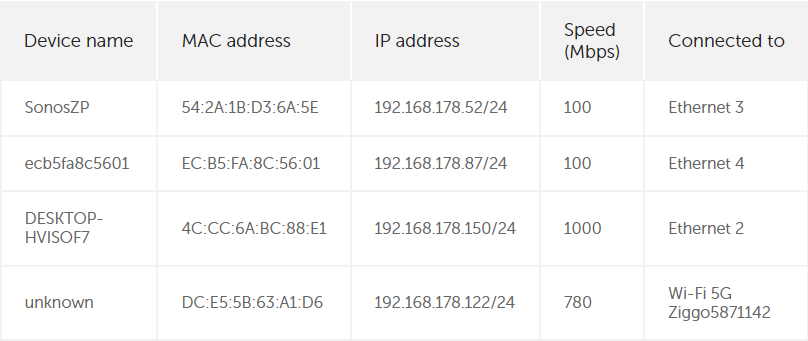
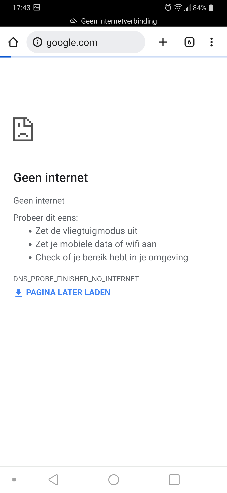

# IP addresses
IP addresses are logical addresses that identify devices on a network. They could be compared in function to a street address. They differ from #MAC addresses, which are more akin to a fingerprint and serve as the physical identifier for a device.

#Networking #IP 

## Key-terms
#### IP addresses
Internet Protocol addresses are a number that identify a device on a network. In the [32-bit](NTW-04_report_binaryhex.md) IPv4 protocol, hey are typically written in the following format: `255.255.255.255`. In the 128-bit IPv6 protocol, addresses are written using hexadecimal, like so: `2001:0db8:84a3:0000:0000:8a2d:0350:6333`

#### IPv4
Internet Protocol version 4 has been superseded by IPv6, but is still incredibly popular and remains the most widely used protocol. It governs how devices communicate over a network.

#### IPv6
IPv6 is a 128-bit protocol that provides many more addresses. Because of its length, it is possible to leave out repeated 0's in the same octet when writing out an address. Further, an IPv6 address is split into two sections: a network component and a node component. This is done by splitting the address in half. The first 64 bits refer to the network, and the final 64 bits to the node.

The bits used for the network portion of the address are used primarily for routing. It's split further into two blocks: one of 48, used for routing over the internet. The other 16 bits are used for subnetting on LANs. The remaining 64 bits draw information from the #MAC address. 

#### Public and private IPs
Public IPs are used to address an entire local network of devices via the router. It is effectively the IP address with which one is visible on the internet. Private IPs are used to identify devices on the local network.

#### NAT
Network address translation is essentially a means of combining a local network of multiple private IPs into a single public IP. This function is typically found on a router or gateway.

#### Static and dynamic IPs
Dynamic IPs change automatically. On a private network these are assigned by the DHCP server. Publically, it is a user's ISP that designates IP addresses. Static IPs are configured manually. They're particularly useful for servers that need to consistently available on the same address.

## Opdracht
### Gebruikte bronnen
[Info on IP addresses](https://www.kaspersky.com/resource-center/definitions/what-is-an-ip-address)  
[Info on IPv4](https://www.cloudns.net/blog/what-is-ipv4-everything-you-need-to-know/)  
[Info on IPv6](http://www.steves-internet-guide.com/ipv6-guide/)  
[Info on NAT](https://www.techopedia.com/definition/4028/network-address-translation-nat)

### Ervaren problemen
I broke the assignment down into two parts, theory and practical exercise.
* First, I broadened my layman's knowledge of the internet protocol and the associated key terms.
* Second, I executed the assignment step by step.
	* I ran into no unexpected issues.

### Resultaat

To start, I used the website https://whatismyip.com to determine the public IP of my phone and desktop. These were the same. An ISP assigns home users a single public IP, which is found on the internet gateway in the home router.  
  
  
The router then sends the internet traffic towards the device that requested it via a private IP address. These addresses, visible below, are different so that the router can differentiate between the devices.  
  
  
  
Upon changing the private IP address of my phone to that of my desktop, my phone disappears from the list of connected devices. While my phone is still connected to the network due to the Wi-Fi protocol operating on a lower layer of the OSI model, and still able to transmit data due to possessing a recognisable IP address, network connectivity issues begin to occur. Websites fail to load or take enormous amounts of time to do so. One posits that this is because the packets requested by the phone are instead sent to the desktop, creating a cascade of errors. My desktop experiences no issues, due to the IP address being associated with its #MAC address.  
  
Finally, changing a phone's IP address on Wi-Fi to a public IP removes its ability to connect to the internet. While still connected to the network due to Wi-Fi being on a lower layer, the faulty IP address means that the router is unable to form a connection on the networking layer.  
