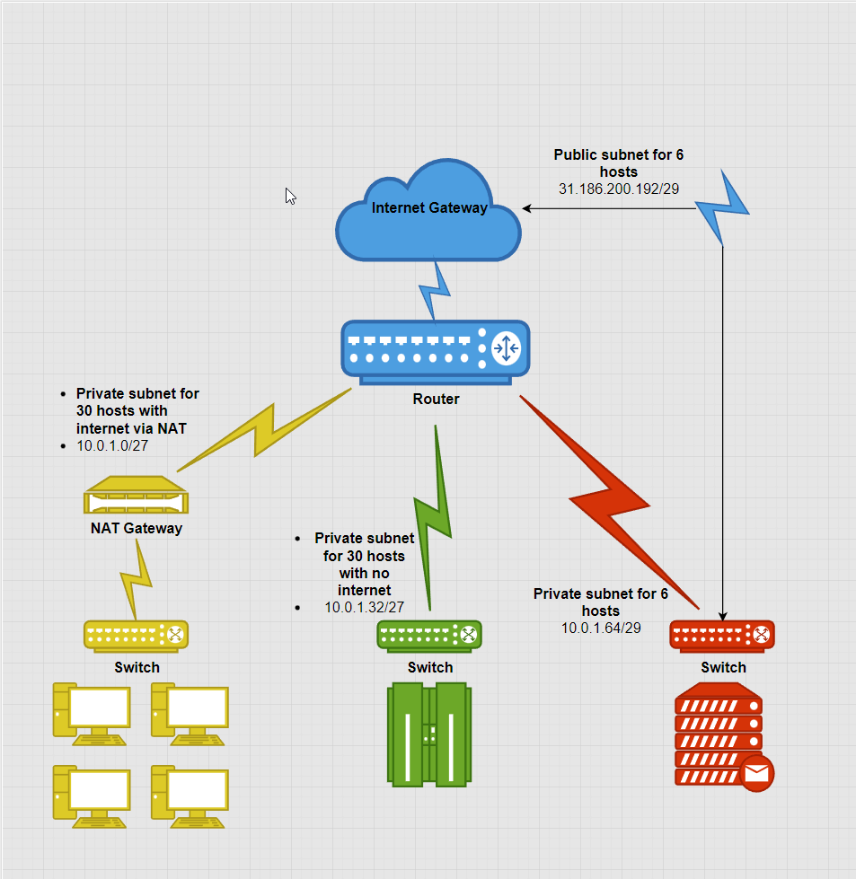

# Subnetting
Subnets are used to divide IP addresses into subnetworks. This allows administrators to set permissions on a subnet basis, creating additional security. 

#Networking #Subnets

## Key-terms

#### #Subnets
Subnetting is a manner of dividing an IP address range into distinct networks. For example, one could create multiple subnets from the range 198.168.1.0 to 198.168.1.255. This is done using bits, therefore each subnet range will be some exponent of 2.  
    192.168.1.0 to 192.168.1.31
    192.168.1.32 to 192.168.1.63  
The above is an example of an address range being divided into 8 subnets of 32 addresses. These could be smaller or bigger depending on the requirements of the network. Two IP addresses per subnet are always reserved: the first as the network IP, and the last as the broadcast IP.
#### Subnet Masking
A subnet mask is used to designate the IP address range for subnets. It divides an IP address into a a host address and a network address and determines how many devices are allowed on the subnet. The easiest way to visualise this is to set all the network bits to 1 and the host bits to 0. This value will be the subnet mask. For example, `255.255.255.0/24` creates a subnet with 8 free bits to be assigned to hosts. `255.255.255.192/26` creates 4 subnets with 6 free bits for hosts, or 62 hosts per subnet.
#### VLSM
Variable Length Subnet Masking allows for subnets to be divided into smaller subnets. Using the previous example under the subnets header, one could use 7 subnets of 32 addresses and create multiple smaller subnets from the final 32 addresses.
#### CIDR
Classless Inter Domain Routing is a manner of condensing routing tables into a smaller size. Instead of dividing a route into an IP address and a subnet mask, it notes the network address and the number of mask bits. For example, `192.168.1.0 255.255.255.192` becomes `192.168.1.0/26` because there are 6 available bits for use by each subnet.
#### Network address
Network addresses are used to identify the network device on a particular subnet. For example, the switch or router.
#### Broadcast address
Broadcast addresses are used to address all devices on a network at once.
#### NAT Gateway
See [NTW-02](NTW-02_report_devices.md) for gateways and [NTW-05](NTW-05_report_ipaddresses.md) for NAT.

## Opdracht
### Gebruikte bronnen
[AWS explanation on public & private subnets](https://docs.aws.amazon.com/vpc/latest/userguide/VPC_Scenario2.html)
[Subnetting and address space tutorial](https://hub.packtpub.com/understanding-address-spaces-and-subnetting-in-ipv4-tutorial/)  
[Subnet calculator](https://www.subnet-calculator.com/)  
[CIDR](https://www.techtarget.com/searchnetworking/definition/CIDR)  
[Network address](https://www.techopedia.com/definition/20969/network-address)  
[Broadcast address](http://ladu.htk.tlu.ee/erika/taavi/doc2/network_and_broadcast_address.html)

### Ervaren problemen
I tackled this assignment by breaking it into two distinct steps.
* First, I had to establish theoretical knowledge on subnets.
	* By finding the right sources that described the information in a digestible way, I was able to make it my own.
* Secondly, I needed to create an overview of networking equipment and architecture in order to create a diagram.
	* Through reading about cloud infrastructure using AWS tutorials I was able to visualise how a network fulfilling the requirements of the assignment would look.

### Resultaat
I created four distinct subnets to complete the assignment.

The first, at 10.0.1.0/27, is a private subnet that has internet access via a NAT gateway. In this way, traffic from the internet should be translated into the correct protocols once the router has directed it to this subnet. With /27, the subnet consists of 32 addresses and has space for 30 hosts.

The second subnet at 10.0.1.32/27 is also a private subnet with 30 hosts. It is connected to the same router but lacking a NAT gateway to translate traffic from the internet. This should allow it to communicate with the other subnets via the router but not with the internet.

The third and fourth subnets, at 10.0.1.64/29 and 31.186.200/192/29 respectively, represent the private and public IP address ranges for the same hosts. The private subnet allows these hosts to communicate with the other private subnets via the router. The public subnet, created via a direct line to the internet gateway, gives each host a unique IP address on the internet.

The gateway itself would also possess a unique IP address, by which all devices on the private subnet with NAT access would be visible. The diagram used for the screenshot below can be found [here.](../NTW-06/NTW-06_subnets.drawio)

