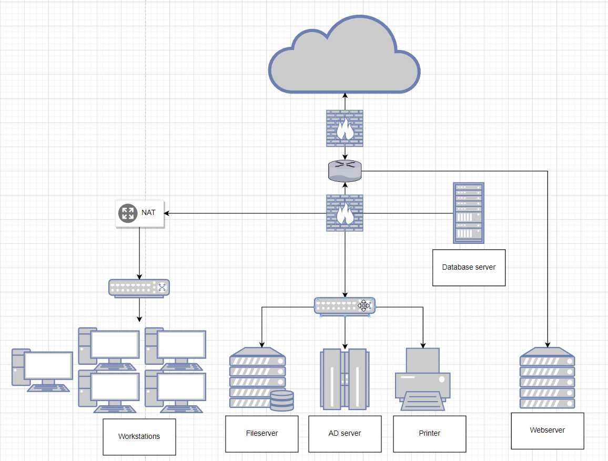

# Networking Case Study
Sketching out a networking architecture can assist in forming a visual of what is otherwise an abstract concept. By doing this, one can visualise what security and hardware requirements are necessary to accomplish a given task.

#Networking #Subnets

## Key-terms
#### AD server
An Active Directory server contains data about devices on a network. It stores information such as passwords and user accounts and makes this available to users and administrators on the basis of the correct authorisation.

#### DMZ
Demilitarised zone. In networking, this is a host or network that sits between an external network such as the internet, and an internal network such as a company's LAN.

## Opdracht
### Gebruikte bronnen
[AD server](https://learn.microsoft.com/en-us/windows-server/identity/ad-ds/get-started/virtual-dc/active-directory-domain-services-overview)
[DMZ](https://www.techopedia.com/definition/10266/demilitarized-zone-dmz)

### Ervaren problemen
* I did not know what an AD server was.
	* I googled it and read about its functions.
* I wasn't sure how to lay out the topology with a focus on security.
	* I asked ChatGPT for assistance and learned the term DMZ. Using this, I was able to find examples on google. Combined with knowledge learned in previous exercises I was able to complete the assignment.

### Resultaat
I decided to split the network into four distinct subnets. A firewall separates the router and the webserver from the internet. A second firewall separates these two devices from the internal network to ensure that even if the webserver is compromised, the internal network remains safe.

The workstations are the only devices on the internal network with internet acccess, and as such they route their traffic through a NAT. The fileserver, AD server and printer, while grouped together in the image, should all have separately configured permissions. The printer should be accessible from the workstations; the AD and fileserver on the other hand should offer different levels of authorisation depending on which user is accessing them.

Finally, the database server containing login credentials is located on the internal network but separated from the rest for security reasons. Given that the webserver reads and writes data to the database server, the database server itself should not be able to write or read information from the rest of the network. Users with proper authorisation on the internal network should however be able to do the reverse on the database server.

Screenshot below, with the original diagram found [here.](../NTW-07/NTW-07_casestudy.drawio)

