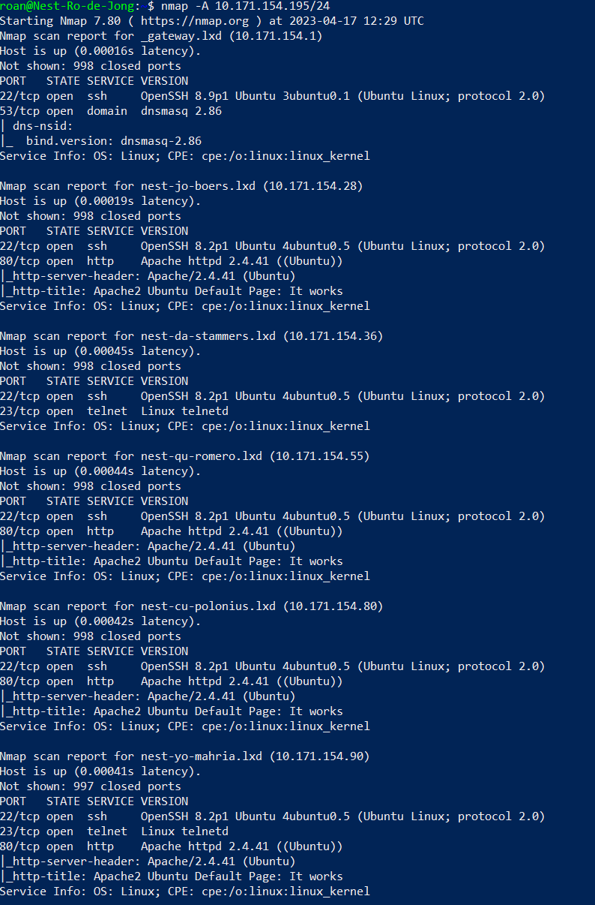
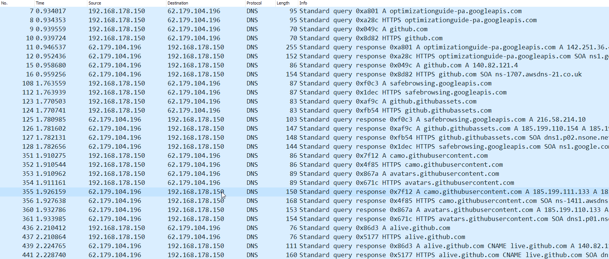
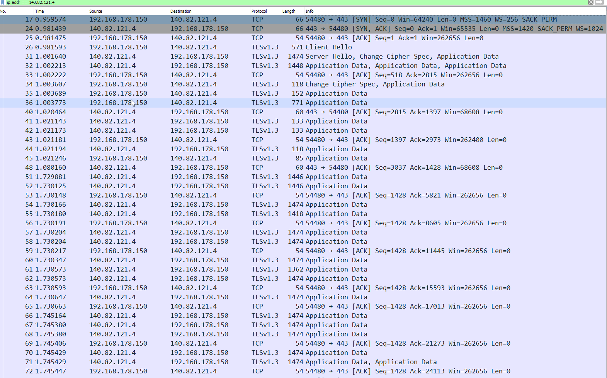

# Network detection
Network detection tools allow one to discover networks and analyse the traffic on them. Nmap allows one to find open ports and their associated protocols on hosts in its network. Wireshark reads all the traffic occuring on a host, including their source and associated protocols. This is useful for discovering vulnerabilities and active breaches, as well as troubleshooting connectivity issues.

#Networking #Cybersecurity #Wireshark

## Key-terms
#### Wireshark
See [NTW-03](../../02_Networking_1/02_completed_assignments/NTW-03_report_protocols.md).

#### Nmap
Network Mapper is open source software that is used to find the hosts and services on a network. It is available on Linux and Windows and can be used to probe networks for vulnerabilities and information about specific devices.

#### Open, filtered, closed, and unfiltered ports
Terms used by Nmap to designate the status of a port. An open port is actively being used by the machine to listen for packets. A filtered port indicates that a firewall or other impediment is stopping Nmap from seeing the status of the port. Closed ports are inactive. Unfiltered ports respond to Nmap, but Nmap is incapable of determing their status as open or closed.

## Opdracht
### Gebruikte bronnen
[Nmap manual](https://nmap.org/book/man.html)  
[Nmap guide](https://www.geeksforgeeks.org/nmap-command-in-linux-with-examples/)  
[Wireshark documentation](https://www.wireshark.org/docs/wsug_html/)  
[Observing TCP in Wireshark](https://www.youtube.com/watch?v=3Zb_EebU22o)  
[How a website functions](https://aws.amazon.com/blogs/mobile/what-happens-when-you-type-a-url-into-your-browser/)

### Ervaren problemen
* Scan the network of your Linux machine using nmap. What do you find?
	* What is the nmap tool and how does it  work?  

To start, I downloaded Nmap onto my Linux VM. I proceeded to skim the manual before asking ChatGPT for a breakdown on its many uses. Following this, I found a source on google that ran me through some commonly used commands and flags.

* Analyse web browser packets in Wireshark.
	* What are the packets sent to and from a website when it's opened?
	* How do I filter for these packets in Wireshark?

I recorded a short snapshot of me opening Github in Chrome and looked up which protocols and packets are sent when querying a website. I found the IP for Github, and using an IP address filter found the packets being transmitted.

### Resultaat
After installing Nmap on my Linux VM, I scanned the subnet I was connected to and found the IP addresses and open ports of the other students' VMs. Furthermore, I discovered that all these ports are unfiltered. I was also able to scan https://www.google.com and discovered that it is open on ports 80 and 443 for tcp traffic via http and https respectively.

When one opens a website in a browser, a few things happen:

1. The client sends a DNS query to determine the IP address behind the URL.
2. A DNS sends a query response with the IP address.
3. The client attempts a #TCP connection with the server by initiating the three-way handshake with a SYN request.
4. Once connected via TCP, the client and server exchange hellos and exchange encryption information.
5. The server begins sending packets containing encrypted data via the TLS protocol.
6. The client acknowledges that it has received the packets via TCP at an interval.

Screenshots below showcase the DNS query and the beginning of the TCP connection.

  
