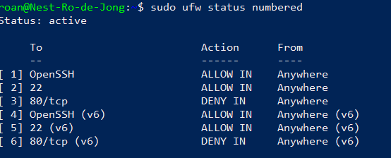

# Firewalls
Firewalls are software or hardware designed to filter incoming and outgoing traffic to a device. Depending on the type of firewall, they do this by analysing the connection or individual packets for factors that break the rules it has been set up with. For example, a software firewall that blocks port 80 will not allow in any traffic through that port.

#Networking #Cybersecurity #IT/Linux

## Key-terms
#### State
State is the last known status of a process or connection. A stateful firewall in this context uses its knowledge of these states to dictate what traffic is allowed through.

#### Stateful firewall
A stateful firewall is a dynamic firewall that sits on Layers 3 and 4 of the OSI model. It analyzes all connections on a network and inspects packets to ensure their legitimacy. For example, it will analyse the handshake in a #TCP connection and block it if there is evidence of tampering. Because it actively analyses connections, a stateful firewall is resource intensive. In contrast to a stateless firewall, a stateful firewall is capable of blocking a a host if it detects a bad connection.

#### Stateless firewall
A stateless firewall utilises a set of rules to determine what traffic is allowed through. If a packet follows these rules, it is allowed through. Unlike stateful firewalls, they are incapable of blocking hosts; instead, individual packets are filtered.

#### Hardware firewall
A hardware firewall is a separate device. As a physical barrier between internal and external networks, they have a higher up-front cost but come with specific benefits. They allow for a single point of configuration for the network's security needs, filter threats before they reach more important devices and provide constant uptime.

#### Software firewall
A software firewall is located on machines in a network. This means that it is capable of analysing outgoing and incoming traffic even on a local network.

## Opdracht
### Gebruikte bronnen
[Basic explanation on firewalls](https://tryhackme.com/room/extendingyournetwork)  
[Stateful firewall](https://www.fortinet.com/resources/cyberglossary/stateful-firewall)  
[Hardware and software firewalls](https://www.fortinet.com/resources/cyberglossary/hardware-firewalls-better-than-software)  
[Curl command](https://linuxize.com/post/curl-command-examples/)  
[UFW manual](https://help.ubuntu.com/community/UFW)  
[UFW tutorial](https://www.digitalocean.com/community/tutorials/ufw-essentials-common-firewall-rules-and-commands)

### Ervaren problemen
* Turn on the apache2 server.
* View the index page on your webserver.
	* How? Find a relevant resource.  

I used google to find the `curl` command to request a webpage via the terminal.
* This ended up being the wrong solution, as I needed to access the page via the internet in my browser. Once I found the correct port number in a document provided by the learning coach, this proved no issue.  

* Configure the *ufw* firewall to block traffic via http.
	* How does *ufw* work?
	* How do I configure it?
* Check if the website is still accessible. 

I found a resource to navigate *ufw* and configured the firewall. This blocked traffic to the website.
### Resultaat
I successfully launched the apache2 web server using knowledge from [week 1.](../../01_Linux_1/01_completed_assignments/LNX-07_report_bash.md) I followed this by seeing if I could access the webserver from a browser on my home PC.
  

After checking that I could indeed load the page, I turned on the firewall via my terminal and blocked http traffic.

