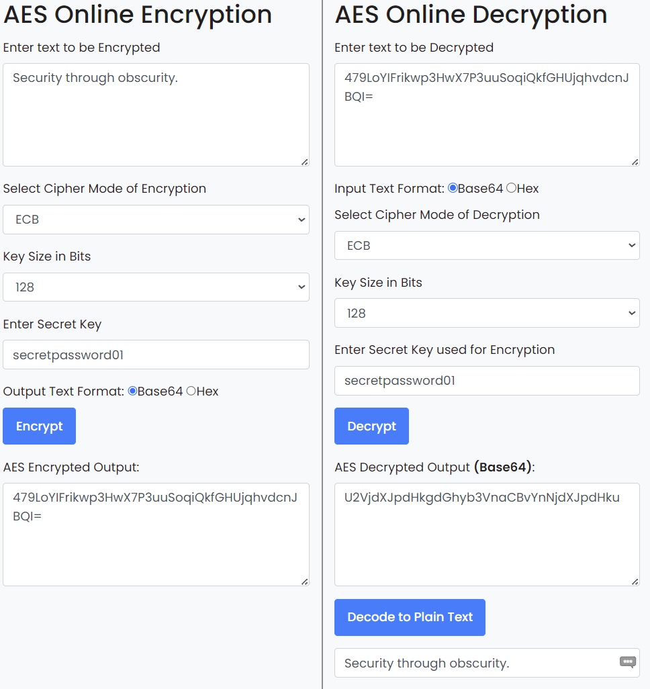
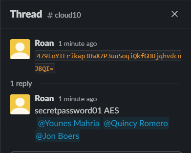
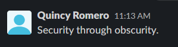

# Symmetric Encryption
Symmetric encryption is a method of encryption that uses a single key to both encrypt and decrypt data. 

## Key-terms
#### Symmetric encryption
Symmetric encryption uses the same key to encode and decode a message. A simple example is a substitution cipher, where each letter in the alphabet is substituted for another. In this way one could write but also read a message by possessing the key.

In computer cryptography, this is a valuable method of encryption because it is computationally inexpensive. The keys tend to be a smaller size relative to their level of protection, they require less computation to create and solving them is easy with the correct key.

The exchange of keys between two parties is a moment of vulnerability for symmetric encryption. Typically this means that any key sent must also be encrypted, and the recipient must already own the key to decipher the new key. This can be where public key pairs come in, a form of asymmetric encryption.

#### Caesar Cipher
The Caesar Cipher is one of the oldest known ciphers. It is a substitution cipher, meaning that each scrambled letter can be directly substituted for their actual counterparts. For example, moving the alphabet right thirteen steps would turn `Hello` into `URYYB`.

#### Vigenère Cipher
The Vigenère Cipher was developed in 1467 by Leon Battista Alberti, but misattributed to Blaise de Vigenère. It is effectively multiple Caesar ciphers in a sequence, that uses a table of columns and rows to encrypt the original message. First, one assigns a key word or phrase that repeats until it matches the length of the message. Then, one assigns a column to the original letter and a row to each letter in the keyword with shifted letters in each row and column. With the key and table in hand, a recipient should be able to decode the message.

#### AES
Advanced Encryption Standard is the most popular symmetric encryption algorithm in existence today. It features a block cipher, 128-bit data and keys that range from 128-bit to 256-bit in size. The variable key range ensures a degree of future-proofing.

#### Twofish
Twofish is a symmetric encryption algorithm and successor to the Blowfish algorithm. It is remarkably fast, with a key size of up to 256 bits. While less popular than AES, it is used for services such as KeePass (a password manager) and TrueCrypt (software that encrypts data as it leaves a device.)

## Opdracht
### Gebruikte bronnen
[Caesar cipher](https://www.khanacademy.org/computing/computer-science/cryptography/crypt/v/caesar-cipher)  
[Symmetric encryption](https://www.ibm.com/docs/en/ztpf/2020?topic=concepts-symmetric-cryptography)
[Public key pairs](https://www.ibm.com/docs/en/ztpf/2020?topic=cryptography-characteristics-public-key-pairs)
[Vigenère Cipher function](https://www.secplicity.org/2017/05/25/historical-cryptography-ciphers/)  
[Vigenère Cipher history](https://www.cryptomuseum.com/crypto/vigenere/)
[AES](https://www.tutorialspoint.com/cryptography/advanced_encryption_standard.htm)  
[Twofish](https://www.encryptionconsulting.com/education-center/what-is-twofish/)  

### Ervaren problemen
I realised that the assignment was impossible while reading the theory and asked the coach for clarification. They confirmed my thesis.

### Resultaat
I read about the required subjects and encrypted a message for transmission in the Slack channel. I hid the key in a reply thread to my own message. Anyone who clicks on the thread, understands what AES is and is able to use google search will be able to solve the encrypted message. 

There is no way to secure a key transfer in a symmetric manner without either sharing information prior to the transfer, or utilising asymmetric encryption. Any method will rely on obfuscation rather than true cryptographic security.

  
  
