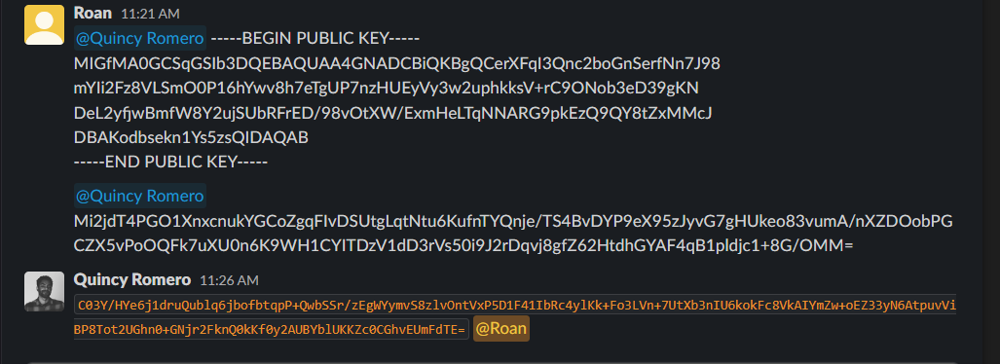
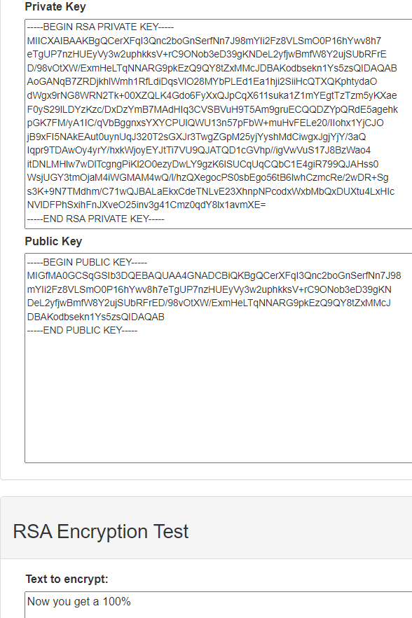

# Asymmetric Encryption
Asymmetric encryption is a form of encryption that allows for the public sharing of keys (for example, over the internet) without compromising security. This can be used, among other things, to secure the transmission of symmetric keys or verify the identity of a source.

#Cybersecurity #Encryption

## Key-terms
#### RSA
Named for its creators, Rivest, Shamir and Adelman. It is a form of public key encryption, also known as asymmetric encryption. It is widely used to secure data transmissions, digital signatures and key exchanges.

#### Public key cryptography
Also known as public key encryption and asymmetric encryption, public key cryptography is a form of encryption that involves a public and private key. The public key is broadcast over the internet; anyone can use it to encrypt a message that can then only be read by the owner of the private key. Conversely, the owner of the private key can also encrypt data with it that can then be read by anyone with the public key. While this does not secure the data, it does certify that the source of the data is the owner of the private key.

#### Hybrid Public Key Encryption
HPKE is a form of hybrid encryption, utilising both symmetric and asymmetric encryption. A symmetric key is generated used to encrypt a message. This symmetric key is then encrypted with a public key, and sent to the intended recipient that owns the private key. With their private key, the recipient can decode the symmetric key and following that, the message itself.

## Opdracht
### Gebruikte bronnen
[Public key cryptography](https://www.ibm.com/docs/en/ztpf/2020?topic=concepts-public-key-cryptography)  
[Hybrid Key Encryption](https://developers.google.com/tink/hybrid)  
[RSA](https://www.javatpoint.com/rsa-encryption-algorithm)  

### Ervaren problemen
I read about public key cryptography and hybrid public key encryption. Following this, I followed the assigment's practical objectives without experiencing issues.

### Resultaat
By using a teammate's public key, I was able to encrypt a message and transmit it only to them via a public Slack channel. Via Zoom they then relayed the contents of the message back to me to confirm they had received it.  

Following this, I transmitted my public key and received an encrypted message from the same teammate. I was able to decrypt this with my private key.  

