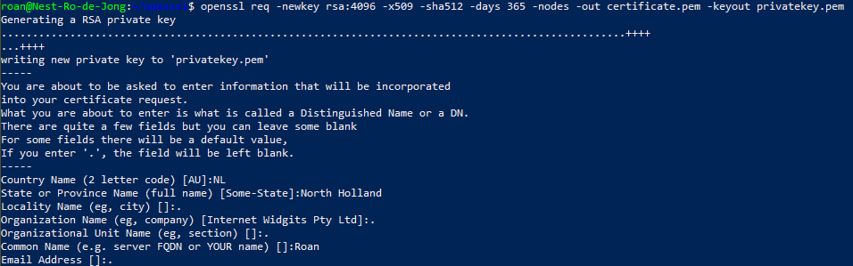
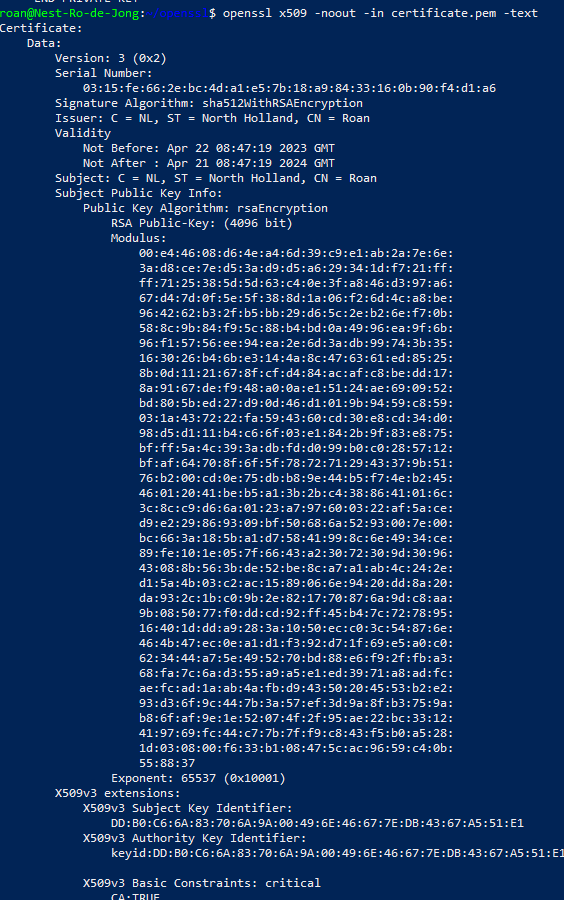
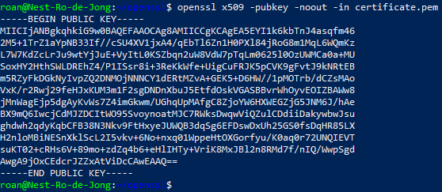
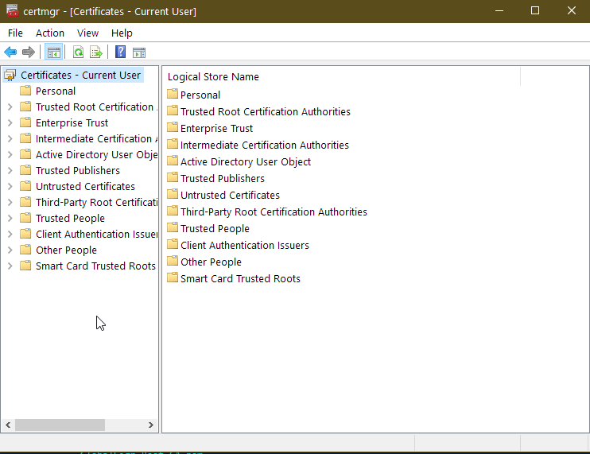
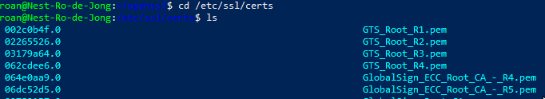

# Public Key Infrastructure
Public key infrastructure describes the process that users and devices are verified as being who they claim. Via a daisy chain of trusted authorities known as Certificate Authorities and the use of public key cryptography identities can be established and verified.

#Cybersecurity #Encryption

## Key-terms
#### Public Key Infrastructure
PKI is a way to authenticate users and devices. PKI serves to link a cryptographic key to a user or device through the signature of a *certificate authority*, or CA. The CA uses a key to sign certificates that verify the authenticity of a link between key and user. Public key infrastructure is reliant on public key cryptography, as described [here.](Sec-05_asymmetricEncryption.md)

#### Certificate authority
*CA*s act as a trusted authority for the issuing and signing of certificates. They are an independent third party in this process. CA certificates are signed by either themselves or another CA, typically called a "root CA", to establish their own authenticity.

#### x.509 standard
X.509 is a standardised format for the creation of public key certificates. It was introduced in 1988 and has since fallen under the purview of the IETF and been adapted for the internet. It is commonly used for protocols such as SSL or TLS, signing documents and electronic IDs.

#### Certificate path
Also known as certificate hierarchy, this defines the process of authenticating not just the authenticity of a certificate but also of the *CA*s that authenticated it. This creates a chain of verification.

## Opdracht
### Gebruikte bronnen
[PKI](https://www.ssh.com/academy/pki)
[X5.09 explanation](https://www.ssl.com/faqs/what-is-an-x-509-certificate/)  
[X5.09 standard](https://www.rfc-editor.org/rfc/rfc3280.html)  
[Certificate paths](https://www.ibm.com/docs/en/sdk-java-technology/8?topic=certpath-x509certificate)  
[Certificate hierarchies](https://www.ibm.com/docs/en/zos/2.1.0?topic=certificates-certificate-hierarchies)  
[Viewing website certificates](https://www.globalsign.com/en/blog/how-to-view-ssl-certificate-details)  
[How to create self-signed certificate on Linux](https://linuxconfig.org/how-to-generate-a-self-signed-ssl-certificate-on-linux/)  
[Where to find certificates on Linux](https://ubuntu.com/server/docs/security-certificates)
[Where to find certificates on Windows](https://learn.microsoft.com/en-us/dotnet/framework/wcf/feature-details/how-to-view-certificates-with-the-mmc-snap-in)

### Ervaren problemen
* Read about PKIs
* Read about the x.509 standard.
* Read about how to analyse certification paths on websites.
	* Analyse the certification paths.
		* Reading about certification paths led me to learn about CAs and hierarchies.
* Read about creating a self-signed certificate on Linux.
	* Create a self-signed certificate.
		* I found a tutorial that took the time to explain the command syntax used so I could understand the process.
* Read about how to find the list of trusted root certificates on both Windows and Linux.
	* Take screenshots of these lists once found.

### Resultaat
To create a key, I used the following command `openssl req -newkey rsa:4096  -x509  -sha512  -days 365 -nodes -out certificate.pem -keyout privatekey.pem`  
* OpenSSL is CLI tool that can be used for a number of different purposes, including creating private keys and reading certificates.
* The `newkey` argument creates a new certificate request and a new private key. With `rsa:4096` specified it creates one with 4096 in the RSA format.
* `nodes` specifies that the new key is not to be encrypted.
* `-out certificate.pem` specifies that the certificate is to be written to the file.
* `-keyout privatekey.pem` specifies what file the private key is to be written to.  

Visible below is the creation of the private key.  
  
Here the initial details of the key can be read.  
  
The public key can also be read using the following command:  
  
Finally, the locations of certificates on a Windows machine can be found by opening **certmgr.msc** via *Run*. On the Ubuntu VM, they're located in `/etc/ssl/certs`.  

