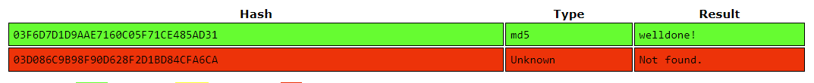
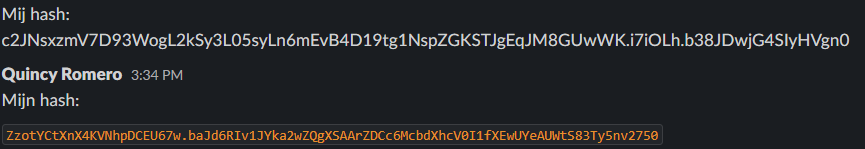

# Passwords
There are multiple ways to store passwords on a server that authenticates users. The simplest is a table where each username and password is stored in *cleartext*, or without encryption. This is insecure: if the database is stolen, every user is compromised. Password hashing is a one-way transformation of a plaintext password into illegible data. Salting takes this one step further, adding a unique string of characters to the password prior to the hashing process ensure that each hash is unique even if the passwords are identical.

#Cybersecurity #Encryption

## Key-terms
#### Password hashing
Password hashing is the cryptographic process of converting plaintext into a fixed-length string of characters. The length depends on the algorithm used. For example, the SHA-256 algorithm will create a 256-bit length string consisting of 64 hexadecimal characters. This is independent of the password's length in plaintext. In addition, the contents of the password have little outcome on the result of the hash. `12345` will result in a very different hash from `12346`.

Hashing is typically irreversible due to the mathematical functions used. For example, by using [modulo operators](https://www.khanacademy.org/computing/computer-science/cryptography/modarithmetic/a/what-is-modular-arithmetic) that leave only a whole-number remainder as the result of the mathematical operation. With a given result, it is impossible to find the operation used to calculate it.

Finally, hashing is deterministic. That is to say, if one inputs a specific string of plaintext it will always result in the same hash. This makes it easy to compare a password input to a stored hash, but also leaves a stolen database vulnerable to a rainbow table attack.

#### Password salting
Password salting is the process of appending or prepending a string of characters to a password prior to the hashing process. This salt is then stored in cleartext alongside the hash and username in the database. When salts are implemented properly, they are a unique string of random characters generated when a new password is stored. This ensures that even if two users have the same password, the resulting hash will be different. This protects against attacks from hash tables and rainbow tables.

#### Rainbow Tables
A rainbow table is a list of hashes and their corresponding cleartext passwords, but with the hashes further reduced to identify specific components such as letters or words. It chains together elements of the hashes, allowing one to start by comparing the last hash in the chain to the one they want to look up and then following the chain backwards until they find a match.

#### Hash Tables
A hash table is a list of hashes and their corresponding cleartext passwords. It is a more computationally efficient vector of attack, with the downside of requiring much more storage capacity. This has become less common with the advent of more powerful CPUs and GPUs.

## Opdracht
### Gebruikte bronnen
[Password hashing](https://auth0.com/blog/hashing-passwords-one-way-road-to-security/)  
[Rainbow tables](https://nordvpn.com/nl/blog/what-is-rainbow-table-attack/)  
[Password salting](https://auth0.com/blog/adding-salt-to-hashing-a-better-way-to-store-passwords/)  
[Explanation about /etc/shadow formatting](https://www.cyberciti.biz/faq/understanding-etcshadow-file/)  

### Ervaren problemen
* What is hashing and why is it preferred over symmetric encryption for storing passwords?
	* Google it.
	* Transcribe the definitions and reasons in my own words.
* What is a Rainbow Table and how is it used to crack hashed passwords?
	* Google and transcribe.
* Try to crack the two passwords in the assignment using a Rainbow Table.
	* This was self-explanatory.
* Create a new user in Linux with the password 12345. Look up the corresponding hash in a Rainbow Table.
	* I referred back to a [previous assignment](../../01_Linux_1/01_completed_assignments/LNX-04_report_usersGroups.md).
* Compare the password hash located in `/etc/shadow` with a peer and read about salting.
	* I had to look up the formatting that was used to identify the salt in order to separate it from the hash.

### Resultaat
Password hashing is preferred over symmetric encryption for the purpose of storing passwords because it cannot be reversed. If passwords were symmetrically encrypted, they would be vulnerable if the keys were compromised. Hashing is a one way process that always has the same result: the same password results in the same hash. With the addition of salting and the sheer number of possible permutations possible in a hexadecimal string, this results in password security that is unfeasible to crack with current computing power.

Below is a screenshot of the two hashed passwords in the assignment run through a rainbow table. Because one is two dictionary words combined with a single symbol, it appears in the list. The second, a string of 16 random characters, produces no results.  
  

Password salting adds a string of randomised characters to the start or end of a password before it is hashed and stored. This salt is randomly generated and stored in cleartext alongside the password and username, visible in the screenshot below as 2p5YGqSuEV5FCwGL. Because of the salt, each of the resulting hashes are unique despite each featuring the same password: **12345**.  
  
  