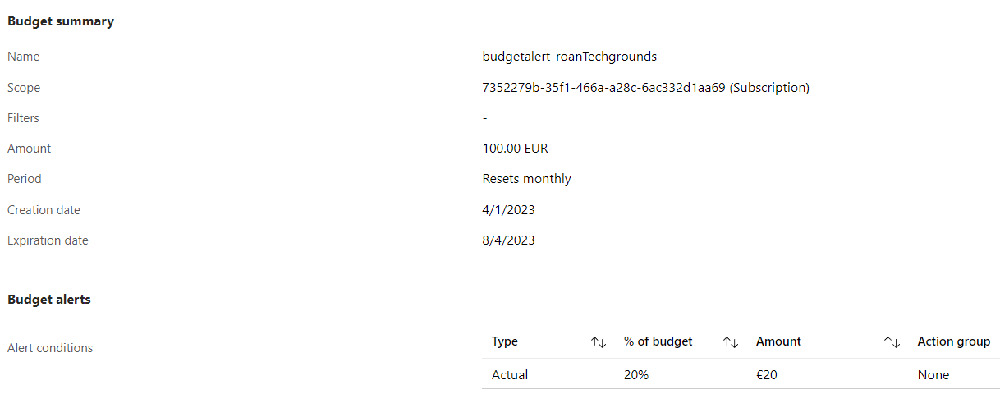

# Cost Management
[Geef een korte beschrijving van het onderwerp]

#Azure/Concepts #Azure/Management #Azure/AZ-900

## Key-terms
#### CapEx
Capital expenditure is the cost of acquiring long-term assets. For example, the purchase of physical hardware or equipment. They typically feature a significant upfront cost.

#### OpEx
Operational expenses refer to money spent to keep things running. For example, pay-as-you-go Cloud services. OpEx features no upfront costs but rather a variable price over time. In Cloud, this makes it simpler to adjust expenses to the workload.

#### TCO
Total Cost of Ownership is a term that refers to the costs of an existing physical environment. With a [TCO calculator](https://azure.microsoft.com/en-us/pricing/calculator/), one can input their current physical infrastructure and compare it to the estimated costs of an Azure environment that supports the same infrastructure requirements.

#### Cost Management principles
##### Planning
Ask oneself:
* What (business) problem am I solving?
* How do I expect my resources to be used?

##### Visibility
Cost Management gives users an overview of what Azure costs they are responsible for. Furthermore, it can offer insight into what resources are underused.

##### Accountability
Because of the suite's transparency, it is possible to hold users responsible for their spending and resource usage.

##### Optimisation
Take action to reduce wasteful spending.

##### Iteration
Each person in the organisation must be active in cost management in order to optimise. 

#### Cost Management suite in Azure
The cost management suite allows one to analyse costs. It is possible to set up multiple budgets and alerts in order to track and notify departments if they are nearing their quota.

#### Resource tags
Resource tags offer another layer of management aside from subscriptions and resource groups to create structure and provide an overview of costs. They can be tweaked through PowerShell, the Azure CLI, templates, the REST API or the Azure portal.

#### Free account
A free subscription features a set of services that are permanently free, and a specific quantity of services that are free for 12 months. 

#### Pay-as-you-go
Pas-as-you-go is a payment model where you pay for the resources used during a billing cycle. This saves costs on unused resources but also allows one to cope with unexpected increases in demand by renting additional resources. For example, VM costs are priced on a per-hour basis but billed per minute of usage. Storage is priced separately.

## Opdracht

### Gebruikte bronnen
[Describe cost management](https://learn.microsoft.com/en-us/training/modules/describe-cost-management-azure/)  
[Cost management suite](https://learn.microsoft.com/nl-nl/azure/cost-management-billing/cost-management-billing-overview)  
[CapEx vs OpEx](https://www.cloudzero.com/blog/capex-vs-opex)  
[Cost management principles](https://learn.microsoft.com/en-us/azure/cost-management-billing/costs/cost-mgt-best-practices)
[Azure free account](https://learn.microsoft.com/en-us/azure/cost-management-billing/manage/create-free-services)

### Ervaren problemen
##### Study:
* Azure cost management principles
	* I read the documentation.
* Free subscription agreement
	* I read the documentation.
* Difference between CapEx and OpEx
	* I found a summary explaining the differences.
* The TCO calculator
	* I followed a tutorial on MS Learn.

##### Assignment
* Create an alert with which you can monitor your own costs.
	* I experimented until I succeeded.
* Understand the options Azure offers that give insight into your expenses.
	* I followed a tutorial on MS Learn.

### Resultaat
[Omschrijf hoe je weet dat je opdracht gelukt is (gebruik screenshots waar nodig).]

