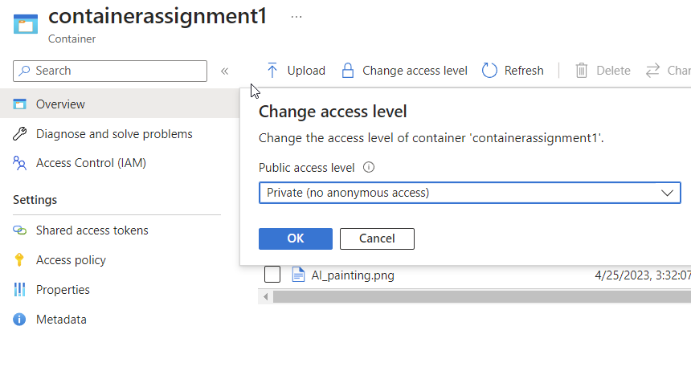
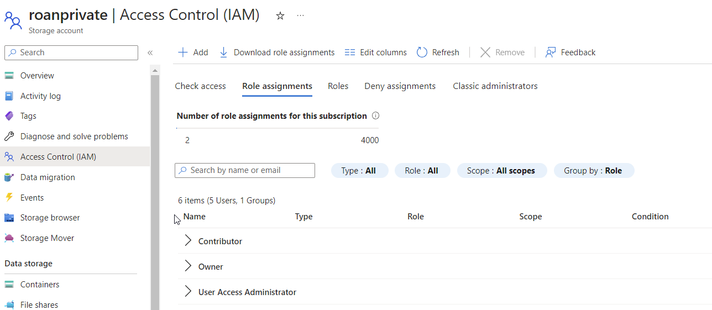

# Azure Storage Accounts
Azure Storage accounts are a resource that group together multiple storage services. The Azure Storage Explorer is software that allows one to view and edit data on these storage services via a GUI.

#Azure/Services #Azure/Architecture #Azure/AZ-900
## Key-terms
#### Azure Storage
Azure offers different manners to store data, such as Azure SQL Database, Azure Cosmos DB and Azure Table Storage. Messaging is handled by Azure Queues and Event Hubs. Loose files can be stored by services such as Azure Files and Azure Blobs. Azure groups Azure Blobs, Azure Files, Azure Queues, and Azure Tables together under the header *Azure Storage.*

#### Storage account
A storage account is a container that groups multiple Storage services together. Only *Azure Storage* services can be added to an account. A storage account allows one to configure these services as a group. A storage account is an Azure resource and can be part of a resource group. Storage Accounts offer Premium and Standard performance tiers. Premium offers higher performance but less redundancy.  
  
##### Blob storage
Data stored in loose containers without true directory capabilities. It is massively scalable, supports text, binary data and big data analytics through Data Lake Storage Gen2.
* Blocks: suited for unstructured data.
* Page: great for random read/write access.
* Append: ideal for appending data, for example for logs.

##### Azure Data Lake Storage Gen2
Data Lake Storage Gen2 refers to functions used for big data analytics, built on Azure Blob Storage. A data lake is a centralised repository for all one's data, structured and unstructured. Data Lake supports hierarchical directory structures, is priced at Azure Blob levels, supports petabytes of data, and supports all Blob features.

##### Files
Files offers file sharing and true directory capabilities. This can be combined with Azure File Sync in order to synchronise with on-premises file servers. Tiering allows one to replicate local files if a certain data capacity is reached.

##### Queues
Small pieces of data that supports FIFO (first in, first out.) Essentially a list of messages in a queue.

##### Tables:
Tables support key-value pairs. Essentially a property, type and name stored together. Useful for user data, metadata and similar things.

##### Access tiers:
Hot, cool and archive are the three different options. Hot is for frequently accessed data, cool for infrequently accessed data and archive for backup and storage. Lifecycle management allows one to automatically move data into different access tiers based on metrics such as last accessed. The archive access tier is set at the blob level.

#### Azure Migrate
Azure Migrate is a service for migration from on-prem to the cloud. It provides:

* **Unified migration platform:** A single portal for all migration needs.
* **Range of tools:** Tools for assessment and migration, including Azure Migrate: Discovery and assessment, and Azure Migrate: Server Migration.

#### Azure Data Box
Azure Data Box is a physical data migration service. This involves shipping an organisation a Data Box storage device with a maximum capacity of 80 terabytes. This is transported to and from the datacenter via regional carrier. It can be ordered and tracked end-to-end via the Azure portal. Data Box is ideal for:

* Onetime migration
* Moving an offline media library to an online media library
* Migrating a VM farm, SQL server and applications to Azure
* Moving historical data to Azure for analysis and reporting with use of HDInsight
* Initial bulk transfer
* Periodic uploads
* Disaster recovery, with data exported from Azure to an on-prem datacenter.
* Security requirements.
* Migration back to on-prem or to another cloud service provider.

#### AzCopy
AzCopy is a CLI utility that can be used to copy, download, or synchronise blobs or files to and from storage accounts. It can be configured to work with other cloud providers to move files between clouds. Synchronisation with AzCopy works in one direction: one designates a source and a destination.

#### Azure Storage Explorer
This is standalone software that provides a GUI for file and blob management. It is compatible with Windows, macOS and Linux. AzCopy serves as a backend to perform all management functions.

#### Azure File Sync
Azure File Sync is a manner of bi-directional syncing between a Windows file server and files in Azure. Its features include:
* Any protocol available on Windows Server for local data access, including SMB, NFS, and FTPS.
* As many caches as needed across the world.
* The replacement of a failed local server by installing Azure File Sync on a new server in the same datacentre.
* The configuration of cloud tiering so frequently accessed files are replicated locally, while infrequently accessed files are kept in the cloud.

## Opdracht
### Gebruikte bronnen
[Create an Azure Storage account](https://learn.microsoft.com/en-us/training/modules/create-azure-storage-account/)  
[Azure Storage Explorer tutorial](https://learn.microsoft.com/en-us/training/modules/upload-download-and-manage-data-with-azure-storage-explorer/)  
[Azure Storage Explorer download](https://azure.microsoft.com/en-us/products/storage/storage-explorer/)  

### Ervaren problemen
##### Assignment 1:
* Create an Azure Storage Account only I have access to.
	* Read about Azure Storage Accounts.
		* Read about data objects such as blobs, files, disks and tables.
* Place data in a storage service of my choice via the console.
	* This involved first creating a container, then uploading an image.
* Download this data to my PC via Azure Storage Explorer
	* Read about Azure Storage Explorer.

##### Assignment 2:
* Create a new container.
	* Read about containers in Azure.
* Upload the 4 files that form the AWS Demo Website
	* Use google to find the files.
		* These ended up being located on the Drive. I had to ask a peer.
* Ensure Static Website Hosting is on.
* Share the URL with a teammate and check if they can see the website.

### Resultaat
The first assignment was to create an Azure Storage account where only I had access to the data. During creation of the container I set default access to private so that only I would be able to access the files within.  
  

Below is a screenshot showcasing RBAC access to the storage account. This is something I cannot edit as a contributor, with the learning coach in control of role assignments.  
  

Once I had set the correct access permissions, I uploaded a .png file to the container and checked to see if it was visible from the Storage Explorer software.  
  

For the second assignment, I needed to upload a set of files from the cloud10 google drive to a new container. With this completed, I turned on static website hosting and had a teammate check to see if the website contained within the files could be accessed via the internet. It was.
  
