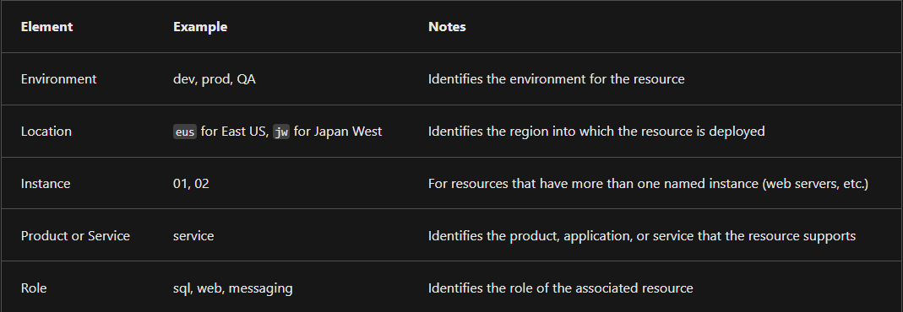
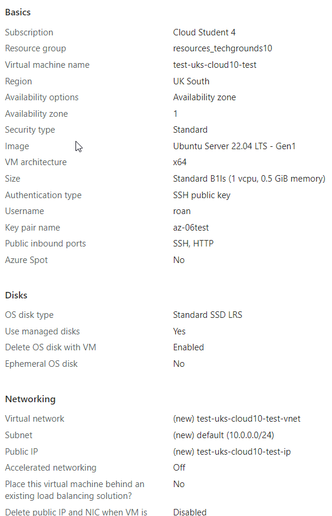
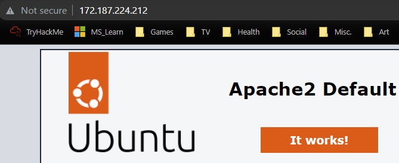

# Virtual Machines
Azure VMs can be configured and launched in a variety of different ways. Via the Azure Portal, or a number of Cloud Shell tools such as the Azure CLI. Setup can be configured ahead of time using templates or done on the fly.

#Azure/Architecture #Azure/AZ-900

## Key-terms
#### Azure Virtual Machines
Azure VMs make use of several *Azure resources* to do their job. 
* The VM itself
* Disks
* A virtual network
* A network interface
* A Network Security Group (NSG)
* An IP address

##### Virtual Machine Availability Sets
These are distinct from Virtual Machine Scale Sets. Availability sets can stagger updates and vary their power and network connectivity, ensuring some VMs remain online in case of network or power failure. They do this by grouping VMs in two manners:
* **Update domain:** The update domain groups VMs that can be rebooted simultaneously. Only one update domain group will be offline at a time. Availability sets can have up to 20 update domains.
* **Fault domain:** The fault domain groups VMs by power source and network switch. By default, an availability set will group VMs across three fault domains.

#### VM naming
VM names are not easy to change after the fact. Good convention for naming includes:  
  

#### [VM Sizing](https://learn.microsoft.com/en-us/azure/virtual-machines/sizes)
* [General purpose](https://learn.microsoft.com/en-us/azure/virtual-machines/sizes-general)
	* Balanced CPU-to-memory ratio. Good for testing and development, small to medium DBs, low to medium traffic web servers.
* [Compute optimised](https://learn.microsoft.com/en-us/azure/virtual-machines/sizes-compute)
	* High CPU-to-memory ratio. Good for medium traffic web servers, network appliances, batch processes, and application servers.
* [Memory optimised](https://learn.microsoft.com/en-us/azure/virtual-machines/sizes-memory)
	* High memory-to-CPU ratio. Good for relational database servers, medium to large caches, and in-memory analytics.
* [Storage optimised](https://learn.microsoft.com/en-us/azure/virtual-machines/sizes-storage)
	* High disk throughput and IO. Good for databases.
* [GPU](https://learn.microsoft.com/en-us/azure/virtual-machines/sizes-gpu)
	* Good for rendering and video editing. Also great for model training and deep learning.
* [High performance compute](https://learn.microsoft.com/en-us/azure/virtual-machines/sizes-hpc)
	* Most powerful CPUs with optional high-throughput network interfaces.

#### VM storage 
  

#### Resource Manager Templates
Resource Manager templates allow one to create a copy of a VM with the same settings. By exporting a template, one can create a JSON file that can be used during deployment of a new VM.

#### Azure CLI
A command-line interface that allows for scripting. Available on multiple OSes and in a browser. It is compatible with other scripting languages like Ruby and Python. A tutorial can be found [here.](https://learn.microsoft.com/en-us/azure/virtual-machines/linux/quick-create-cli)

#### Other utilities
Azure Powershell and Azure CLI are useful for simple scripts and the use of CLI tools. Terraform allows for the creation of config files with HCL (HashiCorp Configuration Language.) The REST API and Azure Client SDK allow for interaction using other programming languages such as C# or Java. Links to further reading on the above subjects are found [here.](https://learn.microsoft.com/en-us/training/modules/intro-to-azure-virtual-machines/4-describe-other-create-vm-options)

#### Azure Site Recovery
Azure Site Recovery is a manner of duplicating infrastructure across multiple locations to deal with regional failover. This could be on-prem infrastructure backed up in the cloud, or cloud infrastructure that can failover to a secondary datacentre. It works with Azure resources, Hyper-V, VMware and on-prem servers.

#### Azure Virtual Desktop
Virtual Desktops separates data and software from the local hardware. This offers centralised management with Azure AD and RBAC.

## Opdracht
### Gebruikte bronnen
[Intro to VMs](https://learn.microsoft.com/en-us/training/modules/intro-to-azure-virtual-machines/)  

### Ervaren problemen
##### Assignment:
* Create a VM with specs listed in the assignment.
	* I ran into no issues by following the instructions.

##### Study:
* Azure VMs
	* I followed a tutorial to learn more about VMs.
* Network Security Groups (NSGs)
	* I read a little about NSGs, and added them to [AZ-10_VNets.](AZ-10_VNets.md)

### Resultaat
By creating a VM by following the instructions I was able to quickly host a website and access it via my browser. Furthermore, I read about VMs and their configuration settings and created notes and references for further learning. Finally, I [exported the template](../AZ-06/) used to create the VM.

  

