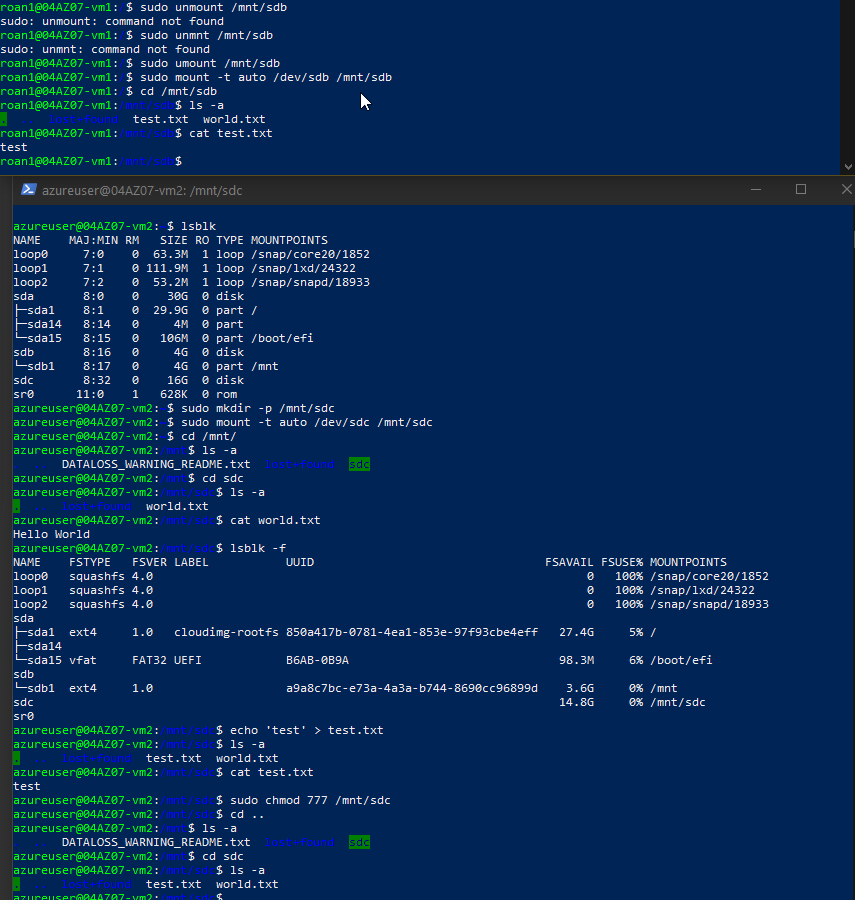
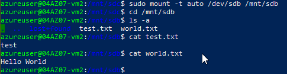

# Disk Storage
Azure Disk Storage allows one to create a virtual storage drive in the cloud. Whether one chooses for a HDD or SSD, there are a multitude of scaling options available. By using a Managed Data Disk, one can also share a disk between multiple VMs. By using a cluster manager such as WSFC (Windows) or Pacemaker (Linux) one can actively access the disk using multiple VMs.

## Key-terms
#### Ultra Disks
Azure ultra disks are the highest performance tier. They are intended for data-intensive workloads such as [SAP HANA](https://www.ibm.com/topics/sap-hana), top-tier databases and transaction-heavy workloads. They can only be used as data disks.

#### Premium SSD v2
Premium SSD v2 sit between ultra disks and Premium SSDs in terms of performance. Capacity, throughput and IOPS can be tweaked without downtime for cost efficiency. It is suited for a variety of different tasks and can be set to any supported size. They cannot be used for OS disks.

#### Premium SSDs
Azure Premium SSDs feature high performance and low latency and are suited for VMs. They feature support for disk bursting, which increases tolerance for sudden changes in IO throughput.

#### Standard SSDs
Standard SSDs are ideal for work that requires consistency at a lower IOPs level. They can be used for web servers, low IOPS application servers and lightly used enterprise applications. They are available on all Azure VMs.

#### Standard HDDs
Standard HDDs are ideal for testing environments and low priority work.

  

#### Billing
Billing when using managed disks takes the following factors into consideration:
* Disk type
* Managed disk size
	* Disk size is rounded up to the nearest provisioned size. For example, 200GiB rounds up to the E15 offer of 256GiB. Billing is per hour of use, also rounded up.
* Snapshots
	* Snapshots are billed based on the size used, not provisioned.
* Outbound data transfers
* Transactions
	* Billing is performed for the number of I/O operations. On standard SSDs, each I/O operation less than 256 KiB is considered a single I/O operation. For HDDs, each IO operation is considered a single transaction, regardless of I/O size.

#### Snapshots
A snapshot is an exact clone of an existing drive, including drive data and metadata.

## Opdracht
### Gebruikte bronnen
[Azure disk types](https://learn.microsoft.com/en-us/azure/virtual-machines/disks-types)  
[Add and size disks in Azure VMs](https://learn.microsoft.com/en-us/training/modules/add-and-size-disks-in-azure-virtual-machines/)  
[Creating a VM via template](https://learn.microsoft.com/en-us/azure/virtual-machines/windows/ps-template)  
[Shared disks](https://learn.microsoft.com/en-us/azure/virtual-machines/disks-shared)  
[Enabling shared disks](https://learn.microsoft.com/en-us/azure/virtual-machines/disks-shared-enable?tabs=azure-portal)  
[Formatting and mounting disks in Linux](https://phoenixnap.com/kb/linux-format-disk)  

### Ervaren problemen
##### Assignment:
* Start 2 Linux VMs. Ensure an open SSH connection.
	* This proved no issue.
* Create an Azure Managed Disk and pair this with both VMs.
	* Read about Managed Disks.
		* I created a managed disk and paired it with both VMs without issue. I ran into problems with mounting and formatting the drive. Formatting once is sufficient and self-explanatory if one is operating with sufficient presence of mind.
* Create a file on the first machine and place this on the shared disk.
	* With the correct permissions set, this proved no issue.
* Check to see if the file is readable on the second machine.
	* This proved no issue once the drive was formatted and mounted correctly. The file was readable, so long as I (re)mounted the disk after its creation.
* Make a snapshot of the disk and try to create a new disk with this.
	* I learned that the Azure Portal requires manual refreshing in order to view updates initiated on another tab.
* Mount the disk and examine the file.
	* This proved no issue.

### Resultaat
To start with, I launched two VMs and created a shared disk. I attached this disk to both VMs using the Azure Portal and then formatted and mounted it on the first VM. I changed permissions on the folder and created a text file. Following this, I mounted the drive on the second VM. I was able to read the file I had written on the first VM.  
  
Upon being able to read the file, my curiosity was awoken and I decided to create another file on the second VM. This was not readable on the first VM. Upon remounting the disk, this changed.  
  
Finally, I created a snapshot and attached it to the second VM. Upon mounting it, I was able to read the files I had previously created.  

