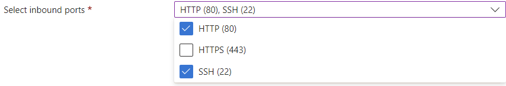
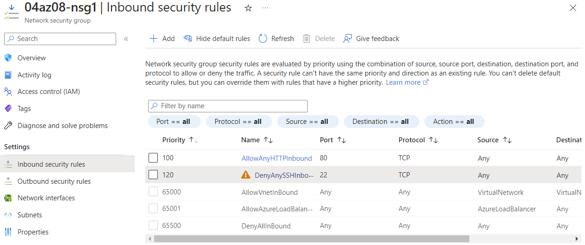

# Firewalls
Azure Firewall is the cloud equivalent of a stateful hardware firewall and gateway in one. Given its NAT and DNS features it is capable of much more than what would be typically expected of a firewall. Furthermore, while it can be compared to a hardware firewall, NSGs can be compared to software firewalls that operate from individual VMs and network interfaces.

#Azure/Services #Azure/Management

## Key-terms
#### Azure Firewall
Azure Firewall is a cloud-based firewall. Typically, it sits within the [hub VNet](https://learn.microsoft.com/en-us/azure/architecture/reference-architectures/hybrid-networking/hub-spoke?tabs=cli) and filters traffic to and from spoke VNets, the internet and any on-premises devices.

#### Azure Firewall Standard
Azure Firewall Standard has the following features:
* NAT functionality
* Application and network rules
* Threat intelligence based on Microsoft's knowledge of malicious IP addresses.
	* Standard offers two intelligence modes: an alert, or an alert and blocking of the traffic.
* Stateful functionality
* Forced tunneling, which allows one to first route outbound traffic to a specific location rather than the internet.
* DNS proxy, custom DNS, web categories en traffic monitoring.

#### Azure Firewall Basic
Azure Firewall basic is ideal for SMB (small and medium size customers.) It is recommended for traffic not exceeding a throughput of 250Mbps. Its features include:
* Support for Threat Intel alert mode, but not alert and blocking.
* Fixed scale unit that runs the service on two VMs in the backend.

#### Azure Firewall Premium
Azure Firewall Premium is intended for sensitive and regulated environments such as the payment or healthcare industries. It features the following:
* TLS inspection, that allows one to decrypt outbound traffic and process the data before reencrypting it and sending it on.
* IDPS (network intrusion detection and prevention system)
* URL filtering, allowing one to block an entire URL instead of the domain.

#### Azure Firewall Manager
This is the place where one manages and configures instances of the Azure Firewall. It allows one to create firewall policies and apply them to multiple firewalls.

#### Firewall Policy
A firewall policy is an Azure resource. It can contain a collection of rules pertaining to the features listed above. As a separate resource, it can be applied to multiple firewalls at once with the Azure Firewall Manager. For example, one could create a base policy for all firewalls and then fork off specialised policies that inherit its rules.

#### Rule priority
Azure Firewall applies rules based on priority. Within the categories below, one can assign further priority values.
1. Threat intelligence
2. NAT
3. Network rules
4. Application rules

#### NSG
NSGs are software firewalls that can control traffic between subnets or VMs. They allow for full control over every network request entering or exiting a VM.

## Opdracht
### Gebruikte bronnen
[Intro to Azure Firewall](https://learn.microsoft.com/en-us/training/modules/introduction-azure-firewall/1-introduction)  
[Configuring NSGs](https://learn.microsoft.com/en-us/training/modules/configure-network-security-groups/1-introduction)  

### Ervaren problemen
##### Assignment:
* Launch a webserver with SSH and HTTP open
* Create an NSG in the VNet. Block SSH traffic to the webserver, but keep HTTP open.
	* I did this twice. First, I launched a webserver with the requisite ports opened and a NIC NSG enabled with no tweaks. This allowed me to immediately access the webserver. Tweaking the NSG had no effect, so I created another VM and launched no NSG. This did not enable instant HTTP access to the webserver, but upon creating a security group with the requisite rules this was fixed.

##### Study:
* Difference between Basic and Premium Firewall
* The difference between a firewall and a firewall policy
* How Azure Firewall is different from a standard firewall
* The difference between Azure Firewall and NSG

### Resultaat
First, I created a webserver VM with the selected ports opened and no NIC NSG. Without a NIC and associated NSG, this did not allow me to access the webserver.
  
Next, I created a network security group and added the requisite rules. This allowed me to access the webserver via HTTP, but SSH remained blocked. I posit that by not installing default NIC settings when creating a VM and resource group, connectivity is hampered.
  

