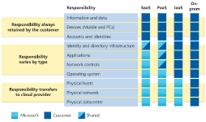

# Shared Responsibility Model
The shared responsibility model describes the relationship between customer, provider and service. Depending on the form of cloud service chosen, the customer and provider will each have a different set of responsibilities. In SaaS, the client is responsible for practically nothing except their data. In IaaS, the customer is responsible for almost everything except the hardware.

## Key-terms
#### Shared Responsibility Model
The shared responsibility model dictates who is responsible for what aspect of the cloud service. For example, the customer will always be responsible for the data stored, whereas the cloud provider will always be responsible for the datacenter.

Different types of cloud services will determine responsibility for some services, such as the applications or operating systems used.

#### IaaS
Infrastructure as a service. This gives the customer the most control over cloud resources. In IaaS, the provider is responsible for the hardware, network and physical security. The customer is responsible for everything else: OS management, network configuration, etc. It could be described as renting hardware.

IaaS features use-cases such as:
* Lift-and-shift migration. The migration of resources from on-premises to IaaS.
* Testing and development. With established configuration settings, it is possible to quickly spin up and shut down testing environments in the cloud.

#### PaaS
Platform as a service sits between IaaS and SaaS. In PaaS, the provider maintains the datacentre, but also the operating systems, middleware, development tools and business intelligence services that are features of cloud computing. Maintenance of this software is also for the cloud provider. Network settings, directory infrastructure and application security are subjects where responsibility can vary depending on the configuration.

PaaS features use-cases such as:
* Development framework. PaaS gives developers a framework for creating cloud-based applications with its built-in software.
* Analytics and business intelligence. The software included with PaaS gives companies the capability to analyse their data.

#### SaaS
Software as a service is effectively the renting of software in the cloud. Examples include email and Office 365. SaaS is inflexible but simple to employ. With SaaS, the customer's only responsibilities are data, account and access management, and potentially directory infrastructure.

Use-cases for SaaS include:
* Messaging
* Business productivity software
* Expense tracking

## Opdracht
### Gebruikte bronnen
[Intro to Cloud: describe the shared responsibility model](https://learn.microsoft.com/en-us/training/modules/describe-cloud-compute/4-describe-shared-responsibility-model)
[Describe cloud service types](https://learn.microsoft.com/en-us/training/modules/describe-cloud-service-types/)
[Further info on cloud service types](https://www.microsoftpressstore.com/articles/article.aspx?p=2979073&seqNum=2)

### Ervaren problemen
The assignment was theoretical. Upon finding qualitative sources I experienced zero issues.

### Resultaat
By studying I built an understanding of the subjects. I included a screenshot for easy, visual reference for later.

