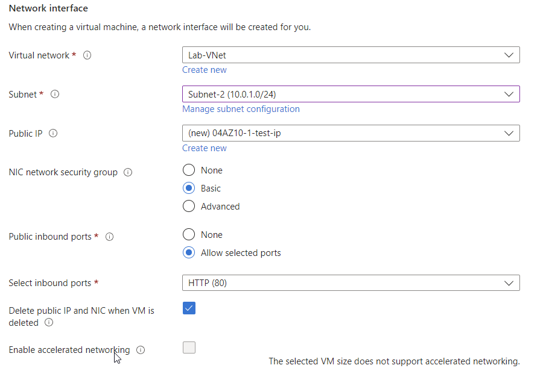
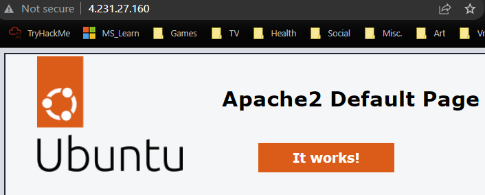

# Azure Virtual Network
Azure Virtual Networks allow resources to communicate with each other, over the internet or with on-premises devices. Just like other networks, they can be configured with subnets and a private IP address range.

#Azure/AZ-900 #Azure/Architecture #Azure/Services 
## Key-terms
#### Virtual Networks
VNets are a set of Azure resources that allow other resources to communicate over a network, with the internet or with on-prem devices. 

#### Network Security Groups
NSGs are software firewalls that can control traffic between subnets or VMs. They allow for full control over every network request entering or exiting a VM.

#### Load Balancer
The Azure Load Balancer can distribute traffic between multiple VMs. 

#### Virtual Machines Scale Sets
Azure virtual machine scale sets allow for the creation of a group of load balanced VMs. These allow scaling on demand or on schedule and provide high availability to applications. Scale sets cost nothing; instead, one pays for the VMs created.

## Opdracht
### Gebruikte bronnen
[Intro to Azure VNets](https://learn.microsoft.com/en-us/training/modules/introduction-to-azure-virtual-networks/)  
[Configuring Azure VNets](https://learn.microsoft.com/en-us/training/modules/configure-virtual-networks/)  
[Configure the network for your VMs](https://learn.microsoft.com/en-us/training/paths/azure-administrator-manage-virtual-networks/)  
[Blocking internet access on subnets](https://learn.microsoft.com/en-us/answers/questions/427589/how-to-block-internet-access-in-azure-virtual-netw)  

### Ervaren problemen
##### Assignment 1:
* Create a VNET with two subnets.
	* I used the Azure Portal to create a VNet resource.
* Ensure subnet 1 has no internet access.
	* I created a second NSG with rules to block all internet traffic and attached it to subnet 1.

##### Assignment 2:
* Create a VM with HTTP access and place it on subnet 2.
	* I created a VM and was able to place it on subnet 2 during creation.

### Resultaat
To start, I created a new Virtual Network resource and associated resource group. Within this resource I designated two subnets and the correct IP address range. This gave me an error message because I had not yet shut down a resource group from a previous assignment.  
  
Once I had done this, I created two NSGs and tweaked the security rules to block all internet traffic on the first subnet. I used the destination: service tag and the internet tag to do this.  
  
Upon completion of these steps, I created a new virtual machine and attached it to subnet 2.  
  
As shown below, this allowed me to access the webserver. Upon further testing I was able to change the subnet attached to the VM by changing the settings on its network interface. While not part of the assignment, this did successfully block me from accessing the webserver.  

