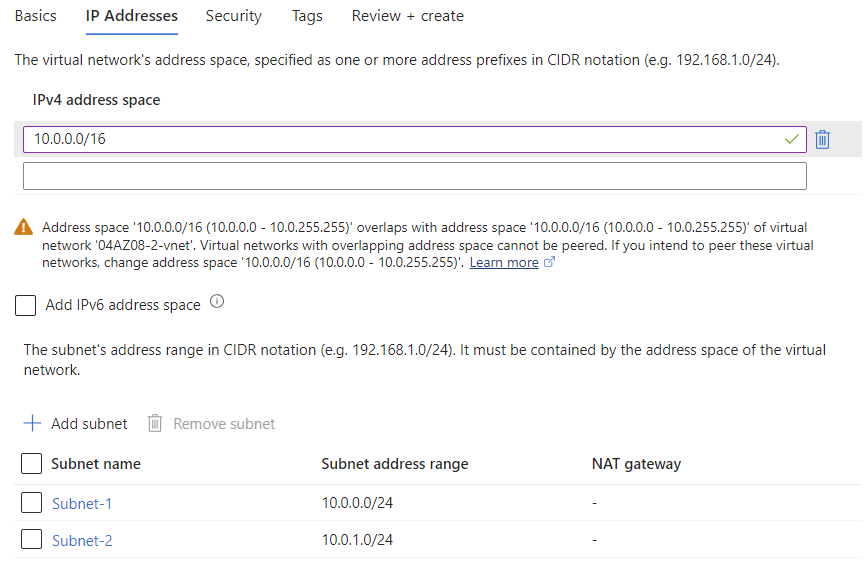
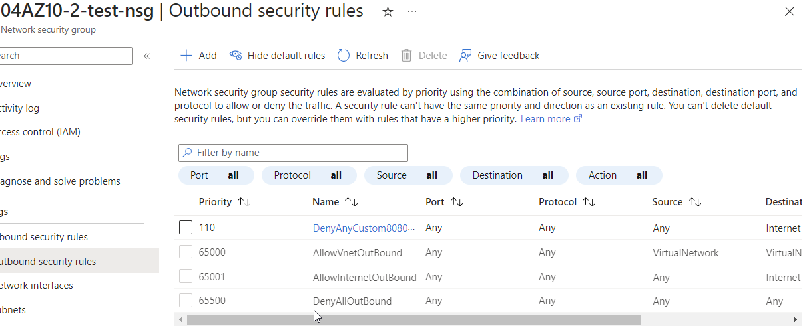

# Azure Virtual Network
Azure Virtual Networks allow resources to communicate with each other, over the internet or with on-premises devices. Just like other networks, they can be configured with subnets and a private IP address range.

#Azure/AZ-900 #Azure/Architecture #Azure/Services 
## Key-terms
#### Virtual Networks
VNets are a set of Azure resources that allow other resources to communicate over a network, with the internet or with on-prem devices. 

* Point-to-site virtual private network connections: for example, a client computer that uses a VPN connection to connect to an Azure VNet.
* Site-to-site virtual private networks: for example, linking an on-premises VPN device or gateway to the Azure VPN gateway in a VNet. This way, Azure devices appear as if on the local network.
* Azure ExpressRoute: a dedicated private connection to Azure that doesn't travel over the internet.

##### Virtual Network Peering
VNet peering allows two networks to connect directly with one another. Network traffic between peered networks is private, travels on the MS backbone network and never enters the public internet. Peered VNets can be in separate regions.

##### UDR
User-defined routes allow for routing table control between subnets, within a VNet or between VNets.

#### Azure VPN Gateway
Azure VPN Gateways can be deployed in dedicated subnets and enable point-to-site, site-to-site and network-to-network connections. They can be policy or route-based, which specifies which traffic is to be encrypted.
* Policy-based VPN gateways check the IP addresses of packets to determine which tunnel the packet is sent through.
* Route-based gateways uses IP routing to determine which tunnel to use. Route-based gateways are the preferred option for on-prem devices. They offer co-existence with Azure ExpressRoute gateway.

Azure VPN Gateways can also serve as failovers for ExpressRoute and be created in a zone-redundant manner.

#### Azure ExpressRoute
ExpressRoute is a dedicated private connection to Azure that doesn't travel over the internet. Each physical location has its own *ExpressRoute Circuit.* ExpressRoute Global Reach allows for the exchange of data across regions without using public internet. ExpressRoute uses BGP (Border Gateway Protocol), offering dynamic routing between on-prem networks and services in the cloud. ExpressRoute has redundancy. It supports four connectivity models:
* CloudExchange colocation: for organisations located in a facility with a cloud exchange.
* Point-to-point ethernet connections.
* Any-to-any connections (IPVPN): via integration of a company WAN with the MS cloud.
* Direct connection from ExpressRoute sites across the world.

#### Network Security Groups
NSGs are software firewalls that can control traffic between subnets or VMs. They allow for full control over every network request entering or exiting a VM.

#### Load Balancer
The Azure Load Balancer can distribute traffic between multiple VMs and serve as a public endpoint.

## Opdracht
### Gebruikte bronnen
[Intro to Azure VNets](https://learn.microsoft.com/en-us/training/modules/introduction-to-azure-virtual-networks/)  
[Configuring Azure VNets](https://learn.microsoft.com/en-us/training/modules/configure-virtual-networks/)  
[Configure the network for your VMs](https://learn.microsoft.com/en-us/training/paths/azure-administrator-manage-virtual-networks/)  
[Blocking internet access on subnets](https://learn.microsoft.com/en-us/answers/questions/427589/how-to-block-internet-access-in-azure-virtual-netw)  

### Ervaren problemen
##### Assignment 1:
* Create a VNET with two subnets.
	* I used the Azure Portal to create a VNet resource alongside my VM.
* Ensure subnet 1 has no route to the internet.
	* This proved more complicated than expected. First, I blocked it with NSG rules. This did not suffice for the assignment. To fix this issue, I followed the steps listed under results.

##### Assignment 2:
* Create a VM with HTTP access and place it on subnet 2.
	* I created a VM and was able to place it on subnet 2 during creation.

### Resultaat
I created a Virtual Network with two subnets and launched a VM with a webserver.  
  
In order to ensure Subnet-1 could not route to the internet, I created a routing table, created a rule to block internet access, and attached it to the subnet. I then tested the network interface with it connected to both Subnet-1 and Subnet-2. With Subnet-2 attached, I could access the webserver via browser. With Subnet-1 attached, this was not possible.
