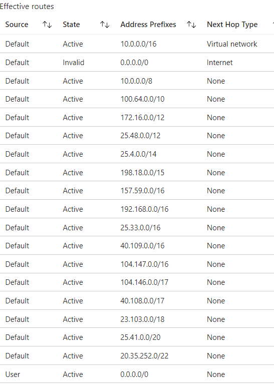

# Azure Virtual Network
Azure Virtual Networks allow resources to communicate with each other, over the internet or with on-premises devices. Just like other networks, they can be configured with subnets and a private IP address range.

#Azure/AZ-900 #Azure/Architecture #Azure/Services 
## Key-terms
#### Virtual Networks
VNets are a set of Azure resources that allow other resources to communicate over a network, with the internet or with on-prem devices. 

#### Network Security Groups
NSGs are software firewalls that can control traffic between subnets or VMs. They allow for full control over every network request entering or exiting a VM.

#### Load Balancer
The Azure Load Balancer can distribute traffic between multiple VMs. 

#### Virtual Machines Scale Sets
Azure virtual machine scale sets allow for the creation of a group of load balanced VMs. These allow scaling on demand or on schedule and provide high availability to applications. Scale sets cost nothing; instead, one pays for the VMs created.

## Opdracht
### Gebruikte bronnen
[Intro to Azure VNets](https://learn.microsoft.com/en-us/training/modules/introduction-to-azure-virtual-networks/)  
[Configuring Azure VNets](https://learn.microsoft.com/en-us/training/modules/configure-virtual-networks/)  
[Configure the network for your VMs](https://learn.microsoft.com/en-us/training/paths/azure-administrator-manage-virtual-networks/)  
[Blocking internet access on subnets](https://learn.microsoft.com/en-us/answers/questions/427589/how-to-block-internet-access-in-azure-virtual-netw)  

### Ervaren problemen
##### Assignment 1:
* Create a VNET with two subnets.
	* I used the Azure Portal to create a VNet resource alongside my VM.
* Ensure subnet 1 has no route to the internet.
	* This proved more complicated than expected. First, I blocked it with NSG rules. This did not suffice for the assignment. To fix this issue, I followed the steps listed under results.

##### Assignment 2:
* Create a VM with HTTP access and place it on subnet 2.
	* I created a VM and was able to place it on subnet 2 during creation.

### Resultaat
I created a Virtual Network with two subnets and launched a VM with a webserver.  
  
In order to ensure Subnet-1 could not route to the internet, I created a routing table, created a rule to block internet access, and attached it to the subnet. I then tested the network interface with it connected to both Subnet-1 and Subnet-2. With Subnet-2 attached, I could access the webserver via browser. With Subnet-1 attached, this was not possible.
