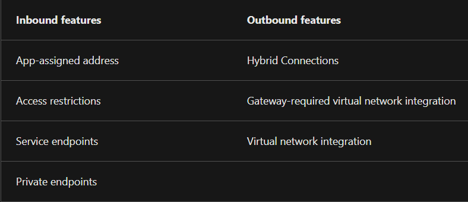

# Azure App Service, DNS and CDN
Azure App Service is a HTTP-based service for hosting web applications. Azure DNS provides DNS registration from within the Azure cloud. Azure CDN provides caching of frequently accessed data on servers geographically close to the end-user.

#Azure/AZ-900 #Azure/Services #Azure/Architecture

## Key-terms
#### Azure App Service
Azure App Service is at its core a HTTP-based service for hosting web applications, REST APIs and mobile back ends. It supports multiple programming languages and both Windows and Linux environments. Key features include:
* **Autoscaling support.**
* **Continuous integration/deployment support:** App Service features integration and deployment with Azure DevOps Services, GitHub, BitBucket, FTP or local Git repositories. This allows App Service to auto-sync code once connected to a source.
* **Deployment slots:** on the Standard App Service Plan, one can deploy web apps to a separate deployment slot instead of the default production slot.
* **Built-in authentication and authorisation support:** App Service supports multiple third-party identity providers, such as Google and Facebook logins.

##### Azure App Service plans
App Service plans define the compute resources that an app requires to run. Upon creation, one selects a region and compute resources are created for the plan. Plans define the OS, region, the number and size of VM instances, and the pricing tier. The pricing tiers are:
* **Shared compute:** On the Free and Shared tiers one runs apps on the same VMs as other App Service apps, including those of other customers. This tier does not scale out.
* **Dedicated compute:** This includes the Basic, Standard, and various Premium tiers. These run on dedicated VMs and only apps on the same plan share these resources. The tier of the plan informs how much the app can scale out.
* **Isolated:** The two Isolated tiers allow one to run dedicated VMs on dedicated VNets. This provides network isolation, compute isolation and the most opportunity to scale out.

##### App Service networking
App Service is a distributed system. This means that different roles handle different tasks. *Front ends* handle incoming HTTP or HTTPS requests. The roles that handle customer workloads are named *workers.* Because App Service scale units host a variety of customers, they cannot be connected directly to a network. Instead, App Service supports a number of features to handle these functions.

##### REST API
REST stands for 'representational state transfer.' A RESTful API is an API that follows a set of architectural constraints. It needs to conform to the following parameters:
* A client-server architecture that manages requests through HTTP.
* Stateless client-server communication, which means that no client information is stored between requests.
* Cacheable data.
* A uniform interface that ensures information is transmitted in a standard manner.
* A layered system that organises servers and requested information into hierarchies.

#### Azure Content Delivery Network
Azure CDN is a service that places content closer to clients attempting to access it across the world. It does this by caching data that is accessed on servers closer to the client. These locations are also known as a POP. CDNs are ideal for static content that is accessed by users worldwide. They have little benefit for dynamic or streamed content, or applications that only service users from a strict geographic area. Azure CDN is also capable of compression.

##### Point-of-presence
POP refers to server locations that host content repositories.

#### Azure DNS
Azure DNS is an alternative to an on-premises DNS server or a DNS registrar. It supports multiple file formats, can be integrated and managed with common Azure tools, and supports public and private zoning, which allows specific DNS records to be limited to private networks. Because of its integration with Azure management tools, Azure DNS can be more efficient than using an external DNS registrar with its own tools.

Managing one's own DNS server is a better option if one requires Active Directory Domain Services or support for DNSSEC.

## Opdracht
### Gebruikte bronnen
[Intro to Azure CDN](https://learn.microsoft.com/en-us/training/modules/intro-to-azure-content-delivery-network/)  
[Explore Azure App Service](https://learn.microsoft.com/en-us/training/modules/introduction-to-azure-app-service/)  
[What is a REST API](https://www.redhat.com/en/topics/api/what-is-a-rest-api)  
[Intro to Azure DNS](https://learn.microsoft.com/en-us/training/modules/intro-to-azure-dns/)  

### Ervaren problemen
##### Study:
* App Service
* Content Delivery Networks
* Azure DNS
	* The assignment was entirely theoretical. I experienced no issues.

### Resultaat
I built theoretical knowledge of the listed subjects.
