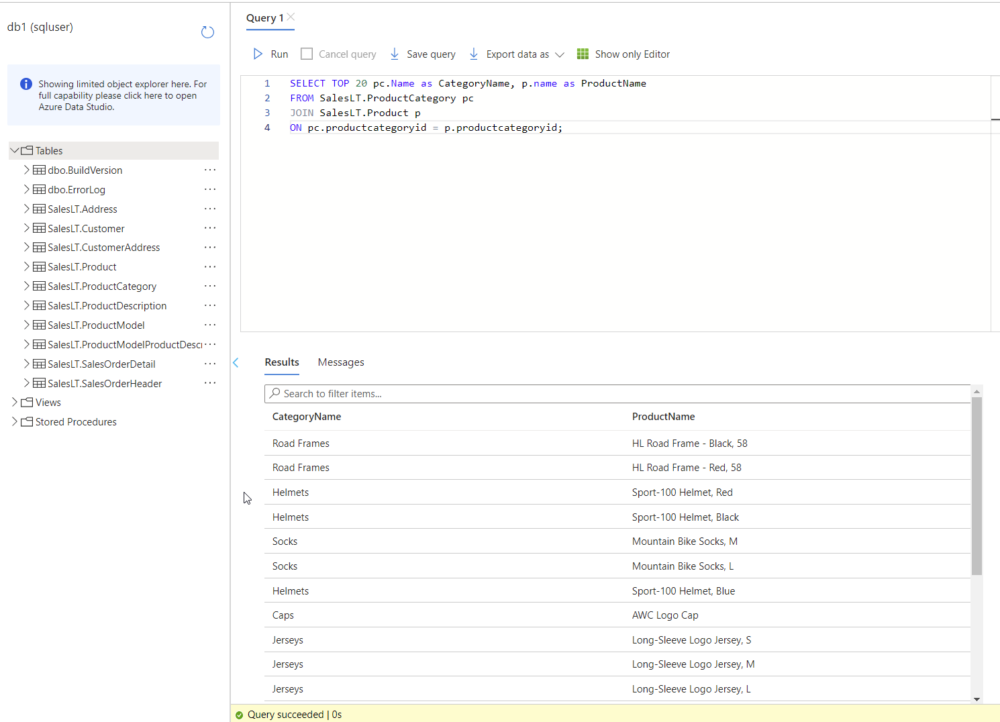

# Azure Databases
Azure Database services provide managed database servers in the cloud. This means that software and security updates are handled by the cloud platform provider instead of being in the hands of the customer.

#Azure/AZ-900 #Azure/Services #Azure/Management 

## Key-terms
#### Azure Database
Azure Database options feature the typical cloud advantages, such as availability and scalability. Many of the databases listed below feature point-in-time-restorations up to 35 days and SLAs with 99.99% uptime agreements. Existing databases can be migrated using the Azure Database Migration Service. These are all managed services.

##### Database terminology
* **Table:** Made up of rows and columns.
* **Primary key:** a unique identifier for a row in a relational database table.
* **Foreign key:** a primary key from one table used in another to form a link and relationship with other tables.
* **Collation:** Sorting rules, case and accent sensitivity properties for data.
* **Non-relational databases:** These do not use tables. Instead, non-relational databases use storage that is optimised for the type of data stored.

##### Azure Cosmos DB
Cosmos DB is a globally distributed, multi-model database service. It works across Azure regions and supports many APIs and SLAs. It stores data in ARS (atom-record-sequence) format. This data is then abstracted and projected with an API, with your choices including SQL, MongoDB, Cassandra, Tables, and Gremlin. This ensures flexibility. It supports schemaless, non-relational data.

##### Azure SQL Database
Azure SQL Database functions as a PaaS database service. It is capable of processing both relational and non-relational data, such as graphs, JSON, spatial, and XML. 

##### Azure Database for MySQL
Azure Database for MySQL is a relational dabase service based on the MySQL Community Edition engine. Several service tiers exist, each offering different performance and capabilities. It is ideal for LAMP (Linux, Apache, MySQL, PHP) solutions.

##### Azure Database for PostgreSQL
Azure Database for PostgreSQL is a relational database service based on the community version of the open-source PostgreSQL engine. It is available in two deployment options:
* **Single Server:**
	* Vertical scaling
	* Pay-as-you-go pricing.
	* Other cloud benefits.
* **Hyperscale (Citus):**
	* Hyperscale (Citus) allows for queries to be scaled horizontally via the use of sharding. 
	* By allowing for parallel processing of incoming SQL queries across multiple servers it is ideal for large datasets of 100GB or more.
	* It supports multi-tenant applications, real-time analytics and high-throughput workloads.

##### Azure SQL Managed Instance
Azure SQL Managed Instance is a PaaS database engine. Similar in many ways to Azure SQL Database, it [features differences](https://learn.microsoft.com/en-us/azure/azure-sql/database/features-comparison?view=azuresql)such as support for Cyrillic characters for collation. It sits in one's VNet.

##### Data Analytics
Azure has many options for data analytics, including:
* **Azure Synapse Analytics:** This allows one to query data using serverless or provisioned resources. Ideal for business intelligence or machine learning.
* **Azure HDInsight:** This is an open-source analytics service. It supports popular open-source frameworks, and can be used for things such as data extraction and transformation.
* **Azure Databricks:** This supports multiple programming languages and data science frameworks in order to develop insights from data and create AI solutions.
* **Azure Data Lake Analytics:** This is an analytics job service that can simplify big data via the use of queries. It is capable of handling queries of any scale by manually setting its power needs.

#### Power BI
Power BI is a software suite that allows one to connect unrelated data sources to visualise and share the data. This data could be an excel spreadsheet, or sourced from databases or Data Lake Storage. 

## Opdracht
##### Assignment:
* Create an Azure SQL Database
* Run a query to examine the same information on the database.

### Gebruikte bronnen
[Database basics](https://www.lido.app/post/database-101)  
[Azure Database fundamentals](https://learn.microsoft.com/en-us/training/modules/azure-database-fundamentals/)  
[Benefits and Usage of Database Resources - John Savill](https://www.youtube.com/watch?v=4sQOF9fSOAU)  

### Ervaren problemen
* Azure Database (+ managed instance)
	* What is this used for?
		* I solved this by building theoretical knowledge.
	* How do I use it?
		* I followed a tutorial on MS Learn to learn how to set up an Azure SQL Database.
	* How do I combine this with other resources?
		* This requires a depth of knowledge that would require time and knowledge outside of the scope of the assignment.

### Resultaat
To start, I found a tutorial in the MS Learn Azure Database fundamentals module that led me to create an Azure SQL Database and SQL server. During creation I selected a sample database to upload that would later allow me to run queries. With this database installed and the correct firewall settings applied to allow me to connect to it, I was able to run a quick query in order to narrow down the information on the database.  
  
To go a step further and connect the database and SQL server to another resource would require knowledge of publishing an application, which is outside of the scope of the assignment.
