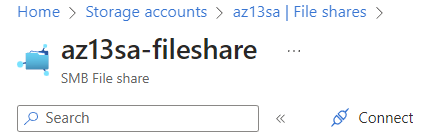
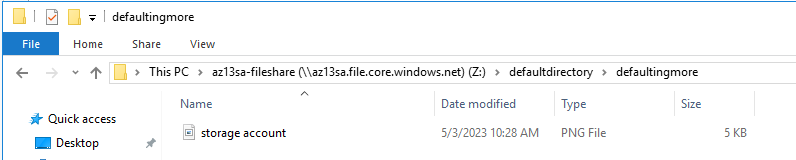
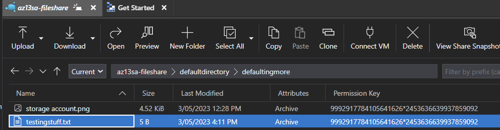

# Azure Files
Azure Files offers an alternative to on-premises file servers, such as NAT servers. Data on a file server can be accessed via a network, making it a more effective solution for read and write operations from multiple machines as opposed to mounting a disk.

#Azure/AZ-900 #Azure/Services #Azure/Architecture 

## Key-terms
#### Azure Files
See also: [Storage Accounts.](../../04_Azure_1/04_completed_assignments/AZ-05_storageAccounts.md) Azure Files offers a filesharing system with true directory capabilities. Connections to Azure Files from another machine can be made via a PowerShell script in Windows, connecting via a mount point in Linux or the terminal in macOS. 

## Opdracht
##### Assignment:
* Create a Storage Account
* Create a file directory and upload a file.
* Connect the directory to a Windows Server VM.
* Check to see if the file can be edited.
* See if the edited file can be downloaded onto a local machine.

### Gebruikte bronnen
[Intro to Azure Files](https://learn.microsoft.com/en-us/training/modules/introduction-to-azure-files/)  
[Benefits and Usage of Storage Account Resources - John Savill](https://www.youtube.com/watch?v=b8BrfsxLSx8)  

### Ervaren problemen
* Azure Files
	* What is this used for?
		* I solved this by building theoretical knowledge.
	* How do I use it?
		* I followed a tutorial on MS Learn to learn how to use this resource effectively.
	* How do I combine this with other resources?
		* I learned how to mount the file share to a VM.

### Resultaat
To start, I created a Storage Account resource using the Azure Portal. Within the Storage Account, I created a fileshare.  
  
I created two directories and uploaded a file. Next, I created a Windows Server VM and used RDP to access it. With a script found in the *connect* link of the fileshare in the Azure Portal, I connected the fileshare to the VM.  
  
I was able to view the file I had uploaded and create a new text file. This file was subsequently visible in Azure Storage Explorer on my local machine.  
  
  
Best practice would include learning Azure User Directory and using this to grant permissions instead of using a sudo key to access the file share.
