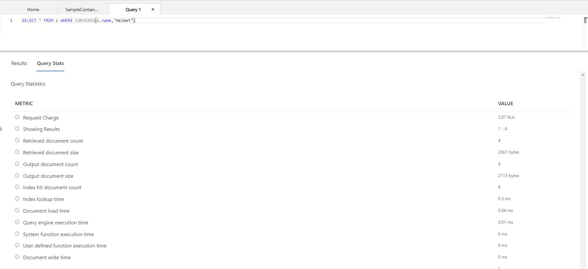

# CosmosDB
Azure Cosmos DB is a flexible database service that stands at the heart of Microsoft's database offerings. It features support for many different formats and is globally distributed.

#Azure/AZ-900 #Azure/Services 

## Key-terms
##### Azure Cosmos DB
Cosmos DB is a globally distributed, multi-model database service. It works across Azure regions and supports many APIs and SLAs. It stores data in ARS (atom-record-sequence) format. This data is then abstracted and projected with an API, with your choices including SQL, MongoDB, Cassandra, Tables, and Gremlin. This ensures flexibility. It supports schemaless, non-relational data as well as relational data.

It is suited for the following scenarios:
* Internet of Things (IoT) and telematics (vehicle telemetry, for example.)
* Retail and marketing
* Gaming: stats, social media integration, leaderboards
* Web and mobile applications

##### Azure Cosmos DB for NoSQL
This model manages data in JSON document format and then uses SQL syntax to work with the data.

##### Azure Cosmos DB for MongoDB
MongoDB is an open source database that uses the Binary JSON (BSON) format. Azure CosmosDB for MongoDB allows the use of MongoDB client libraries and code.

##### Azure Cosmos DB for PostgreSQL
Cosmos DB for PostgreSQL allows database scaling across multiple nodes as performance requirements increase. PostgreSQL is a relational database system.

##### Azure Cosmos DB for Table
Cosmos DB for Table offers greater scaling and performance than Azure Table Storage.

##### Azure Cosmos DB for Apache Cassandra
Apache Cassandra is another open source database that uses a column-family storage structure. It also supports SQL syntax.

##### Azure Cosmos DB for Apache Gremlin
Apache Gremlin is used for data in graph structure. Data entries form nodes that connect to others via relationships on these graphs.

#### Read-Replicas
Read-replicas are synchronised read-only replicas of one master database. This offers the benefit of low latency for the act of reading from the read-replica without complicating the process of writing data. All web servers write to the one master database.

#### IoT
The Internet of Things refers to devices embedded with sensors that are connected to a network.

#### [Azure IoT Hub](https://learn.microsoft.com/en-us/azure/iot-hub/iot-concepts-and-iot-hub)
IoT Hub is an Azure service for communication between the cloud and devices. It is ideal for sending and receiving data and updates to remote devices. It can integrate with other Azure services such as Event Grid and Logic Apps. It is a PaaS solution and effectively the backend for IoT communication in Azure.

##### [Azure IoT Central](https://learn.microsoft.com/en-us/azure/iot-central/core/overview-iot-central)
Azure IoT Central is an application platform as a service (aPaaS). It is a more streamlined solution than IoT Hub, featuring templates and dashboards.

#### [Azure Sphere](https://learn.microsoft.com/en-us/azure-sphere/)
Azure Sphere is a security-focused application platform for communication with internet-connected devices. It doesn't provide the functionality the other IoT services do, but as an end-to-end security solution it can communicate with them. It is built out of three things:
* A microcontroller unit (MCU)
* A custom high-level Linux-based OS
* A cloud-based security service: AS3.

## Opdracht
#### Assignment:
* Establish theoretical knowledge of Azure Cosmos DB.
* Create a Cosmos DB account.
* Create a sample database in this account.
* Modify the data in the sample database.
* Query the database.
### Gebruikte bronnen
https://learn.microsoft.com/en-us/azure/azure-monitor/essentials/monitor-azure-resource

### Ervaren problemen
I experienced no problems with the assignment.

### Resultaat
When creating an Azure Cosmos DB account, one is first prompted to select a service and database format from the list above. I chose for Azure CosmosDB for NoSQL. What followed was a standard Azure Portal resource creation process.

Once the resource had been created, I used the data explorer tab on the left to gain access to a quick start option which let me create a sample database. I added a new entry to the database and ran a simple query that returned the new entry.  

