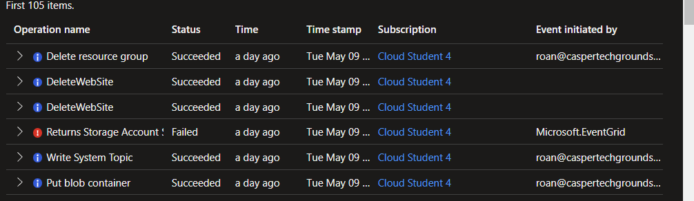

# Azure Monitor
Azure Monitor is a service that allows one to collect, analyse and visualise data about resources.

#Azure/AZ-900 #Azure/Management 

## Key-terms
#### [Azure Monitor](https://learn.microsoft.com/en-us/training/modules/describe-monitoring-tools-azure/4-describe-azure-monitor)
Azure Monitor allows one to collect, analyse and visualise data that relates to their resources. It can be used to monitor Azure, on-prem and multi-cloud resources. Using *Azure Monitor Alerts*, one can automate alerts based on thresholds, but also have it automatically attempt to correct the issue. They can be configured based on log events but also metrics. 

##### Azure Log Analytics
Azure Log Analytics lets one run log queries on data collected by Azure Monitor. This allows one to perform simple queries but also more complex statistical analyses on the data. For example, finding records and using Log Analytics to sort, filter and analyse them.

##### Application Insights
This is another Azure Monitor feature that allows one to monitor web applications in Azure, on-prem or in another cloud. This can be done by installing an SDK in the app or via use of the Application Insights agent. The agent is supported in C#.NET, VB.NET, Java, JavaScript, Node.js, and Python. Information Application Insights can monitor includes:
* AJAX (Asynchronous JavaScript and XML) calls from web pages,including response times and failure rates.
* User and session counts
* Performance counters from Windows or Linux server machines, such as CPU or network usage.
* Page views and load performance as reported by users' browsers.

## Opdracht
##### Assignment:
* Find Azure Monitor in the portal.
* View data from the previous weeks.

### Gebruikte bronnen
[John Savill: Azure Monitor](https://www.youtube.com/watch?v=v68jL-l9Fww)  
[Describe Azure Monitor](https://learn.microsoft.com/en-us/training/modules/describe-monitoring-tools-azure/4-describe-azure-monitor)  
[Azure Monitor documentation](https://learn.microsoft.com/en-us/azure/azure-monitor/)  

### Ervaren problemen
None.

### Resultaat
Azure Monitor is available via both the search function and the menu on the left. It features a bevy of options to collect and analyse occurences and data on resources. Change Analysis, for example, allows one to view changes made to resources. This can be set to filter important, normal or noisy events.
  
An activity log is also available.
  
There are [many tutorials available](https://learn.microsoft.com/en-us/azure/azure-monitor/essentials/monitor-azure-resource) in the documentation for more granular exploration of Monitor's features.
