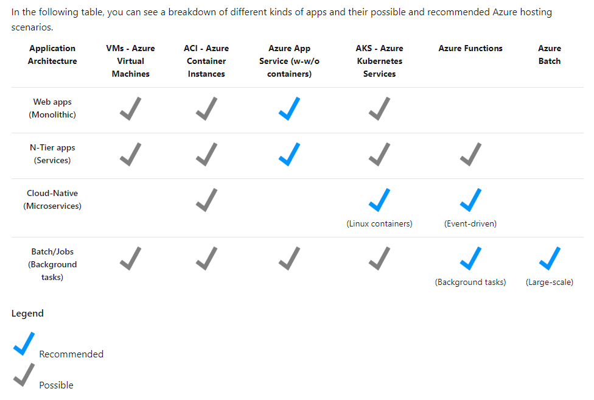
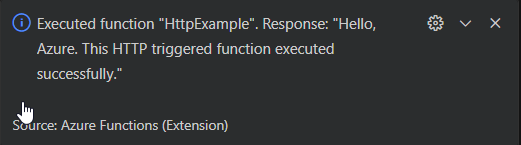
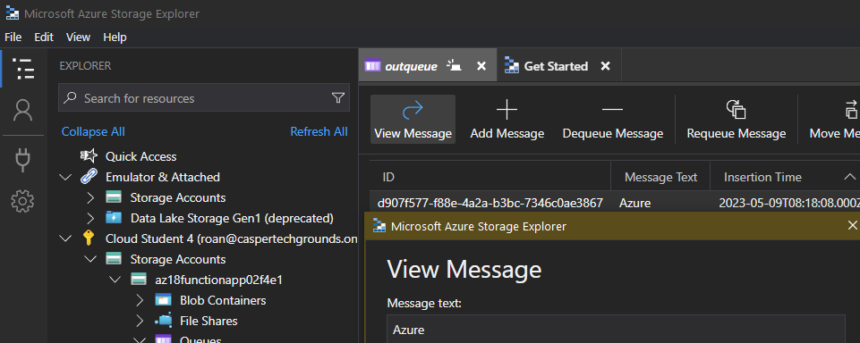
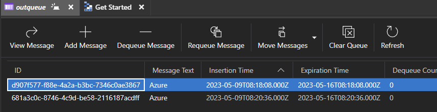
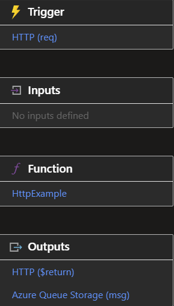

# Azure Functions, Containers and Queue Storage
Azure Functions is a serverless, fully managed compute option that allows for the execution of code without any resource management overhead. Containers are software packages that contain all necessary components to run on any OS or device that meets their hardware requirements. Queue Storage is a storage account service described better [here.](../../04_Azure_1/04_completed_assignments/AZ-05_storageAccounts.md)

#Azure/AZ-900 #Azure/Services 

## Key-terms
#### Containers
A container is a software package that contains all the tools necessary to run anywhere. They contain application code and its dependencies, such as programming language runtimes and libraries. They allow the software to run in a layer that is abstract from the actual environment.

Their benefits include:
* **Separation of responsibility:** This allows different teams to focus on different things. Developers can focus on the application, while operations can focus on deployment.
* **Workload portability:** Containers can run on practically any system, physical or virtual; on any OS, such as Linux, Windows or MacOS; even in the public cloud.
* **Application isolation:** Containers virtualise physical resources such as the CPU on the OS level, which provides a view of the OS that is logically isolated from other applications.

Containers are a more lightweight alternative to VMs. They virtualise at the OS level instead of the hardware level, and share the OS kernel, which means that they use much less memory than a VM. They also allow one to run multiple instances of an application on a single machine.

#### Azure Container Instances
Azure Container Instances allow one to run containers in Azure without having to manage a VM or use another service. Benefits include fast startup times, potential internet access and an interactive shell. They offer application isolation, custom sizing, and are designed to run a single application. Container instances support linking with Azure Files and VNets. They are a PaaS offering.

#### [Azure Kubernetes Service](https://learn.microsoft.com/en-us/azure/aks/intro-kubernetes)
AKS is a service to deploy a managed Kubernetes cluster in Azure. One pays for the number and size of the nodes used by the cluster. Azure Kubernetes Service integrates with many Azure monitoring, access and compliance tools.

#### [Kubernetes](https://kubernetes.io/docs/concepts/overview/)
Kubernetes is open-source software for the automated deployment and scaling of containerised software. A Kubernetes [cluster](https://kubernetes.io/docs/concepts/overview/components/) consists of a set of machines, called nodes, that can run containerised software. 

#### Docker
Docker is a containerisation platform that can be used to develop, ship and run containers. Docker can run on a local machine, in server environments and the cloud. 

#### [Azure Functions](https://learn.microsoft.com/en-us/training/modules/describe-azure-compute-networking-services/6-functions)
Azure Functions is a serverless compute option that is activated by events. Instead of maintaining a VM or container, an event wakes the function and executes the underlying code. Upon completion, the compute resources are deallocated. Azure Functions supports stateless or stateful functionality. By default, Functions is stateless; it behaves as if it is restarted each time it activates. With stateful functionality enabled, it uses a context to track prior activity.

Its primary benefits are no VM management, autoscaling and a consumption based model. Functions contains many input-output bindings, making it ideal for background tasks that execute when specific events trigger.

#### Azure Logic Apps
A serverless, no or low-code solution based on graphical abstractions called connectors. 

#### Serverless compute
Serverless computing refers to event-driven computing. For example, a Functions app that is activated when a particular event happens and then deallocates upon completion of its task.

## Opdracht
#### Assignment:
* Create a Functions App
* Upload the App
* Connect the App to Queue Storage
* Check to see if messages are stored upon running.

### Gebruikte bronnen
[Intro to Docker Containers](https://learn.microsoft.com/en-us/training/modules/intro-to-docker-containers/)  
[What are containers](https://cloud.google.com/learn/what-are-containers)  
[Azure Container Instances](https://learn.microsoft.com/en-us/azure/container-instances/container-instances-overview)  
[Describe Azure compute and networking services](https://learn.microsoft.com/en-us/training/modules/describe-azure-compute-networking-services/)  
[John Savill: Benefits and Usage of Serverless Technologies](https://www.youtube.com/watch?v=-xeJGiMw5OE)
[Tutorial for Azure Functions](https://learn.microsoft.com/en-us/azure/azure-functions/create-first-function-vs-code-python?pivots=python-mode-configuration)  
[Connect Azure Functions to Azure Storage](https://learn.microsoft.com/en-us/azure/azure-functions/functions-add-output-binding-storage-queue-vs-code?pivots=programming-language-python&tabs=in-process%2Cv1)  

### Ervaren problemen
None.

### Resultaat
Following a quickstart tutorial in the Azure Functions documentation, I used Visual Studio Code to create a Python-based HTML trigger. By selecting *create function* under the *workspace* dropdown in the left menu, I was able to create this function on the basis of a template. Next, I used F5 to launch into debug mode and executed the function by right clicking on it. This resulted in a hello message being sent.  
  
Next, I used VSC to create a Function app in Azure and then deployed the HTML trigger to it. A second execution of the function resulted in another successful response.

With this step completed, I then prepared to connect the trigger to Azure Queue Storage. This required creating a binding extension and copying some code into the project. I ran the function locally, and it successfully added a message to the Queue Storage that was visible from within Storage Explorer.  
  
Next, I deployed the app and executed the function again. Another message was added to the queue.  
  
Finally, I checked the Azure Portal to see how the function looked there.  
  

The code for the project I used is available [here.](../AZ-18_functions)

