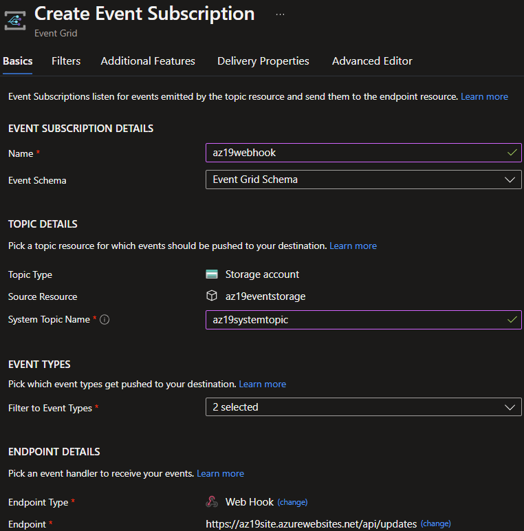

# Azure Messaging Services
There are three messaging services in Azure: Event Grid, Event Hubs and Service Bus. Each is useful in different scenarios.

## Key-terms
#### Events
An event is a notification of a change in a condition or state. This might be the notification that a file has been created. The event consumer decides what to do with the information; the publisher of the event does not care.

#### Messages
A message is data created by a service that is consumed or stored somewhere else. The message contains the data that triggered the message. The message publisher expects the consumer to process the message in a specific way and respond upon completion of the process.

#### Azure Service Bus
Service Bus is a managed message broker that supports message queues and publish-subscribe topics in a namespace. It can be used for messaging, decoupling applications so that message producer and consumers do not need to be online simultaneously, load balancing, and transactions. Transactions are the process of obtaining a message, processing it and posting it to a queue, and removing the input message from the original queue.

##### Publish-subscribe topics
Messages can be published to topics, to which other applications or services can subscribe. This allows for messages to be sent to multiple consumers in a simple manner.

##### Namespace
A namespace is a container for messaging components, such as queues and topics. A single namespace can support multiple topics or queues and is frequently a container.

#### Azure Event Grid
Event Grid is an event broker that allows one to to communicate events such as system state changes to other applications, services or endpoints. It uses a pay-per-event pricing model wherein the first 100 000 operations per month are free. Key concepts for Azure Event Grid include:

* **Events:** What happened.
* **Event sources:** Where the event took place.
* **Topics:** The endpoint where publishers send events.
* **Event subscriptions:** The endpoint or mechanism to route events. This can be to more than one event handler.
* **Event handlers:** The service or application that reacts to an event.

#### Azure Event Hubs
Event Hubs is ideal for the processing of big data. It can receive and process millions of events per second.

## Opdracht
#### Assignment 1:
* Create an Azure Service Bus namespace.
* Within the Service Bus namespace, create a queue, a topic, and three subscriptions to this topic.

#### Assignment 2:
* Create a Storage Account
* Using a template, create a web app that displays event messages.
* Create an event subscription in the storage account and use the webapp as endpoint.
* Create a blob container and upload a file to it.
* Check the web app for changes.
### Gebruikte bronnen
[What is Azure Event Grid](https://learn.microsoft.com/en-us/azure/event-grid/overview)  
[Event Grid Quickstart](https://learn.microsoft.com/en-us/azure/event-grid/blob-event-quickstart-portal)  
[What is Azure Service Bus](https://learn.microsoft.com/en-us/azure/service-bus-messaging/service-bus-messaging-overview)  
[Service Bus Quickstart](https://learn.microsoft.com/en-us/azure/service-bus-messaging/service-bus-quickstart-portal)  
[Compare messaging services](https://learn.microsoft.com/en-us/azure/service-bus-messaging/compare-messaging-services)  

### Ervaren problemen
None.

### Resultaat
For assignment 1, I used the Azure Portal to create a Service Bus namespace. On the toolbar there are options to create queues and topics. Upon creation of a topic, I was able to navigate to a new page where I could create three subscriptions.  
  
Actual publication and subscription for messages would require coding an app.

For assignment 2, I followed another quick start tutorial. To start, I created a Storage Account and used a template from the tutorial to create a web app that displays event messages.  
  
Next, I registered Event Grid under Subscriptions in the Azure Portal. I navigated to Events under the storage account and created an event subscription with a webhook and the URL for the webapp as an endpoint.  
  
The website showed the creation of this event subscription.  
  
Finally, I created a blob container in the storage account and uploaded a file. The event viewer displayed the details of this event.  
  

