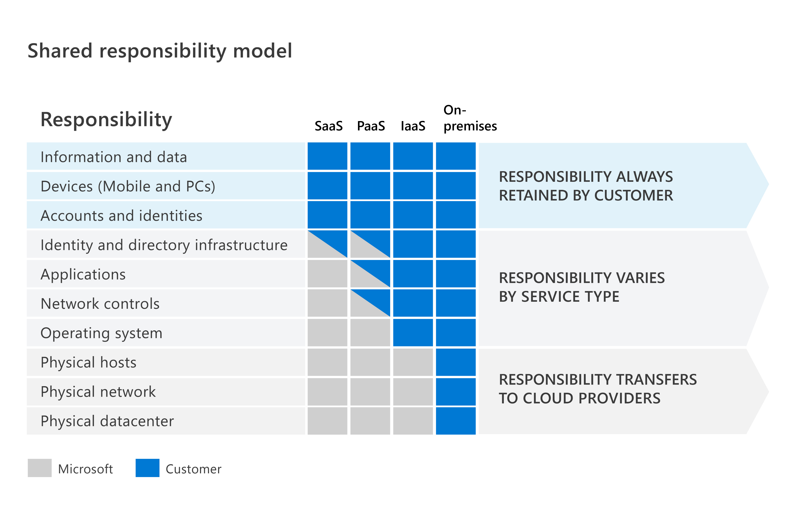

# Security, compliance and identity concepts

See also [AZ-16.](../06_Azure_3/06_completed_assignments/AZ-16_activeDirectorySecurity.md)

### [Shared Responsibility Model](https://learn.microsoft.com/en-us/training/modules/describe-security-concepts-methodologies/2-describe-shared-responsibility-model)
Responsibilities always retained by the customer include information and data management, device security and the safekeeping of accounts and identities.  

### [Defence in Depth](https://learn.microsoft.com/en-us/training/modules/describe-security-concepts-methodologies/3-describe-defense-depth)
See [AZ-16.](../06_Azure_3/06_completed_assignments/AZ-16_activeDirectorySecurity.md)

#### Confidentiality, Integrity, Availability
CIA stands for confidentiality, integrity and availability. These are the core tenants of a cybersecurity strategy.

* **Confidentiality** stands for keeping sensitive data secure. Keeping data encrypted and the encryption keys confidential is one way to ensure this.
* **Integrity** means ensuring that data or messages are correct and not falsified. For example, that an email message someone receives is the same as the one sent.
* **Availability** is about ensuring that data is available to those who need it, when they need it. An example could be giving employees at an organisation authorisation to access decrypted data.

### [Zero Trust Model](https://learn.microsoft.com/en-us/training/modules/describe-security-concepts-methodologies/4-describe-zero-trust-model)
See also [AZ-16.](../06_Azure_3/06_completed_assignments/AZ-16_activeDirectorySecurity.md)

The six foundational pillars of the Zero Trust Model are:
* **Identities:** these could be users, services or devices. Identities must be verified with authentication protocols, and follow the principle of least privilege.
* **Devices:** monitoring devices for health and compliance is important.
* **Applications:** these allow for the use of data. Therefore, identification of all applications in use is important. This is sometimes called *Shadow IT* due to not all applications being managed centrally. Application access and permissions fall under this pillar.
* **Data:** the classification, labeling and encryption of data based on its attributes.
* **Infrastructure:** The assessment of versions, configuration and JIT access alongside the usage of telemetry to detect attacks and anomalies are ways to improve security.
* **Networks:** Network segmentation is important. Real-time threat protection, end-to-end encryption, monitoring and analytics allow further protection and insight.

### Encryption and hashing
See [Sec-04](../03_Security_1/03_completed_assignments/Sec-04_symmetricEncryption.md), [Sec-05](../03_Security_1/03_completed_assignments/Sec-05_asymmetricEncryption.md), [Sec-06](../03_Security_1/03_completed_assignments/Sec-06_publicKeyInfrastructure.md) and [Sec-07](../03_Security_1/03_completed_assignments/Sec-07_passwords.md) for more details on symmetric encryption, asymmetric encryption, public key infrastructure and password hashing.

##### Data at rest
Data at rest refers to data stored on a physical device. It is data not in transit. Encryption of data at rest ensures it is unreadable without the proper keys.

##### Data in transit
Data in transit is data that is moving from one location to another, such as over the internet or a private network. Encryption at the application layer with HTTPS is an example of encryption in transit.

##### Data in use
Encryption of data in use involves securing it in nonpersistent storage, such as RAM or CPU caches. This can be done with technologies that create an [enclave](https://csrc.nist.gov/glossary/term/enclave) that keeps the data encrypted while the CPU processes it.

### Compliance concepts
Governments and industry groups issue and enforce regulations regarding the use and governance of data. This includes the following concepts:

* **Data residency:** This refers to compliance regarding the physical location where data is stored and the hows and whens of transferring, processing and accessing it internationally.
* **Data sovereignty:** This refers to the concept that data, and in particular personal data, is governed by the laws and regulations of the country in which it is physically collected. This can make things complicated: one piece of data might be collected in one place, stored somewhere else, and processed somewhere else yet again. This might make it subject to laws from different countries.
* **Data privacy:** This refers to transparency about the collection, processing, use and sharing of personal data. Personal data refers to any information that is related to an identified or identifiable natural person.

### Identity as primary security perimeter
