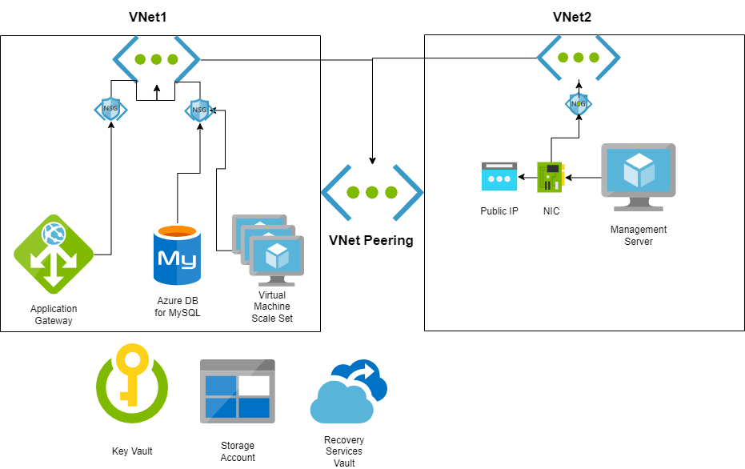

# Introduction
This document lays out a blueprint for the design of the project. It explains which services have been used and the reasoning behind these decisions. Deviations from the requirements and any assumptions made to improve the final product will be discussed. Furthermore, integration points and dependencies for chosen services within the architecture will be brought to light.

# Project Overview
Project Stafford consists of multiple Bicep templates and Powershell scripts. It is designed to deploy the following in an Azure cloud environment:
1. A webserver running Apache in Linux.
2. An application gateway to govern internet access to the webserver.
3. A management server running Windows Server.
4. Two peered virtual networks, their subnets and network security groups.
5. A database server attached to the webserver.
6. A storage account for all necessary data storage, including post-deployment scripts.
7. Backup services for the above.
8. A key vault for the secure storage of credentials.

By deploying these templates and scripts, system administration and security teams will have all they need to test and launch apps in a consistent, repeatable manner.

# Services Selected
## Networking
In accordance with the project requirements, two virtual networks have been created and peered to allow devices on one network to access devices on the other. Virtual Network 1 serves as the front end: attached to it are the virtual machine scale set running the webserver, and the application gateway that handles internet traffic accessing the webserver. Virtual Network 2 acts as a back-end: the management server, database and any virtual desktops deployed at a later date are connected to this. These networks are split into multiple subnets: 10.10.10.0/25 and 10.10.10.128/25 are delegated to VNet1, and 10.10.20.0/24 is delegated to VNet2.

Network security groups attached to each subnet account for the security of the connected Azure services and virtual machines. Specific configurations and requirements are listed under their respective resources below.

Due to the requirements of the Application Gateway, a decision was made to create an extra subnet in order to host it.

## Management Server
The management server consists of a VM running the latest version of Windows Server, as well as its dependencies such as a NIC and public IP. Given the project's focus on cost efficiency, the decision was made to size the VM in a variable; this ensures that no accidental upsizing will occur and incur additional costs.  

The management server is accessible via the internet with RDP and SSH from a select number of public IP addresses. These are configured in an array and can be assigned in the parameter file. By doing so, one can finetune access permissions. Lastly, it is backed up on a daily basis by the Recovery Services Vault.

## Webserver
The webserver is hosted on a virtual machine scale set with internet access controlled by an Application Gateway. It runs the latest version of Ubuntu with Apache installed via a custom data script parsed as Base64 in the Bicep code. The webserver scales up capacity at a sustained 75% CPU utilisation, and down at 25% CPU utilisation.

The scale set and app gateway are located on distinct subnets on VNet1. Network Security Groups act as a software firewall on these subnets. The Application Gateway is accessible from the internet, with HTTP traffic redirected to HTTPS. The scale set is not open to the internet: it is accessible via HTTP and HTTPS from devices on VNet1, and via SSH from the management server.

An Application Gateway was chosen as load balancer due to its ability to filter and redirect traffic based on layer 7 of the OSI model.

## Database
Azure Database for MySQL serves as the database server supporting the above webserver. It features a private endpoint located in the same subnet as the webserver that allows for a connection between the two, with a firewall preventing public internet access. MySQL was chosen due to its support for LAMP stacks.

## Storage
A singular Storage Account is deployed to host any necessary post-deployment scripts and the project's other storage requirements. 

## Backups
The project's backup requirements are an RPO of 1 day and an RTO of 1 hour. As a managed service, Azure Database for MySQL features automatic backups. These are retained for 7 days. The management server is also backed up to a Recovery Services Vault, with those backups defined by the default policy. These are retained for a month. This vastly exceeds the project's requirements, but storage is cheap and lost data is not.

## Key Vault
The Azure Key Vault created with the project hosts the encryption keys for disk storage and backups, as well as passwords for the servers. Due to the Azure tenant environment the project will be deployed to, a decision was made to use antiquated user access policies instead of role based access control. Limitations on rights granted in the Active Directory make this the only option for successful deployment.

The policies grant the disk encryption set used to encrypt the VMs the rights to encrypt, decrypt, wrap and unwrap keys. Furthermore they grant the person deploying global privileges over the Key Vault, ideal for testing.

# Summary
In conclusion, the services selected for the project fulfil or exceed all requirements. The Bicep code allows for the repeated deployment of these services to different resource groups, with unique strings serving as resource names to prevent any issues. A parameter file serves to fill in any other details for repeated deployment.

# Diagram
