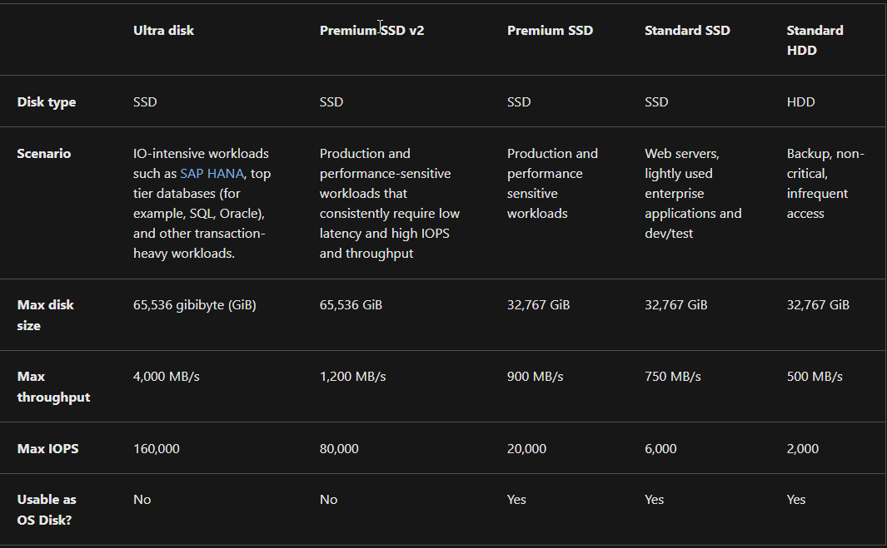

##### Assignment:
* Start 2 Linux VMs. Ensure an open SSH connection.
	* This should be doable simultaneously.
* Create an Azure Managed Disk and pair this with both VMs.
	* Read about Managed Disks.
* Create a file on the first machine and place this on the shared disk.
	* Refresh memory on Linux file directories.
* Check to see if the file is readable on the second machine.
* Make a snapshot of the disk and try to create a new disk with this.
* Mount the disk and examine the file.

#### Ultra Disks
Azure ultra disks are the highest performance tier. They are intended for data-intensive workloads such as [SAP HANA](https://www.ibm.com/topics/sap-hana), top-tier databases and transaction-heavy workloads. They can only be used as data disks.

#### Premium SSD v2
Premium SSD v2 sit between ultra disks and Premium SSDs in terms of performance. Capacity, throughput and IOPS can be tweaked without downtime for cost efficiency. It is suited for a variety of different tasks and can be set to any supported size. They cannot be used for OS disks.

#### Premium SSDs
Azure Premium SSDs feature high performance and low latency and are suited for VMs. They feature support for disk bursting, which increases tolerance for sudden changes in IO throughput.

#### Standard SSDs
Standard SSDs are ideal for work that requires consistency at a lower IOPs level. They can be used for web servers, low IOPS application servers and lightly used enterprise applications. They are available on all Azure VMs.

#### Standard HDDs
Standard HDDs are ideal for testing environments and low priority work.

  

#### Billing
Billing when using managed disks takes the following factors into consideration:
* Disk type
* Managed disk size
	* Disk size is rounded up to the nearest provisioned size. For example, 200GiB rounds up to the E15 offer of 256GiB. Billing is per hour of use, also rounded up.
* Snapshots
	* Snapshots are billed based on the size used, not provisioned.
* Outbound data transfers
* Transactions
	* Billing is performed for the number of I/O operations. On standard SSDs, each I/O operation less than 256 KiB is considered a single I/O operation. For HDDs, each IO operation is considered a single transaction, regardless of I/O size.

[Azure disk types](https://learn.microsoft.com/en-us/azure/virtual-machines/disks-types)
[Add and size disks in Azure VMs](https://learn.microsoft.com/en-us/training/modules/add-and-size-disks-in-azure-virtual-machines/)
[Creating a VM via template](https://learn.microsoft.com/en-us/azure/virtual-machines/windows/ps-template)
[Formatting and mounting disks in Linux](https://phoenixnap.com/kb/linux-format-disk)