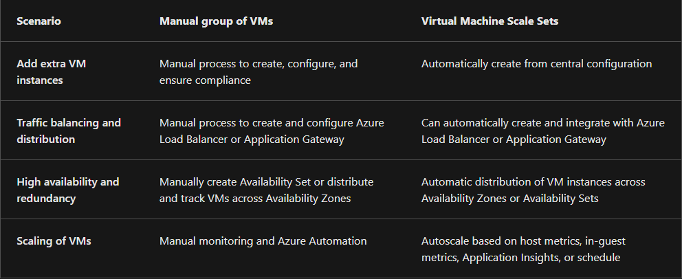
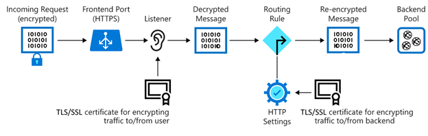

##### Study:
* VM Scale Sets
* Auto Scaling
* Azure Monitor
* Azure Load Balancer
* Application Gateway
* SSL termination
* Web Application Firewall

##### Assignment 1:
Create a VM scale set with the following requirements:
* Standard_B1ls, SSH & HTTP open, Standard SSD.
* Initial instance count: 2
* Scaling Policy: Custom
	* 1 VM minimum, 4 VM max
* Add a VM at 75% CPU utilisation
* Remove a VM at 30% CPU utilisation

##### Assignment 2:
* Check if you can access the webserver via the endpoint of the load balancer.
	* It took me a minute to configure the load balancer and VMSS correctly, but accessing the webserver via the public IP of the load balancer proved no issue afterwards.
* Execute a load test on the servers to activate auto scaling.
	* I utilised the `stress` tool in Linux to load both initial VMs to 100% CPU utilisation. This resulted in extra VMs being created.

#### Virtual Machine Scale Sets
Azure Virtual Machine Scale Sets are a manner of scaling applications on a set of VMs. They allow one to automatically increase or decrease the number of VMs based on demand or a pre-configured schedule. Scale sets can automatically configure the new VMs added. They are suited for compute workloads, big-data workloads and container workloads. To determine the availability of a VM instance, it uses a health probe or the Application Health Extension. The maximum number of VMs in a scale set is 1000.

#### [Autoscaling](https://learn.microsoft.com/en-us/training/modules/intro-to-azure-virtual-machine-scale-sets/3-how-azure-virtual-machine-scale-sets-work)
Autoscaling is a manner of scaling a scale set up and down. It's ideal for variable workloads and can be configured based on metrics or a schedule. Metric-based scaling can be configured on a set of conditions, rules and limits. Common metrics include:
* Percentage of CPU usage
* Inbound flows and outbound flows: network traffic to and from VMs
* Disk read and write operations per second.
* Data disk queue depth: How many I/O requests are waiting to be serviced by the data disks.  
Each scale condition that is met by the VM workload is acted upon.

#### Azure Spot
Azure Spot instances allow one to utilise excess compute resources on the global Azure infrastructure. This results in cost-savings of up to 80%, but VMs used this way are temporary. If Azure requires the extra compute resources, Azure Spot VMs are shut down.

#### Azure Advisor
The Azure Advisor is a monitoring solution that evaluates Azure resources and suggests improvements based on the [Well-Architected Framework](https://learn.microsoft.com/en-us/azure/well-architected/).

#### Azure Service Health
Azure Service Health tracks the status of not only one's deployed resources, but also the global status of Azure. It does this by combining three different Azure services:
* **Azure Status:** this provides a wide view of Azure's global status. It provides information about service outages and incidents that might have widespread impact.
* **Service Health:** this provides a more focused picture. It centres on the Azure services and regions that one is using. This makes it the best place to look for information on outages, planned maintenance and other issues. Because Service Health knows which services one uses, one can set up alerts to notify of potential incidents that might have an effect on usage.
* **Resource Health:** this provides information about the health of individual resources. It can be configured to provide alerts about changes in availability.

#### [Azure Monitor](https://learn.microsoft.com/en-us/training/modules/describe-monitoring-tools-azure/4-describe-azure-monitor)
Azure Monitor allows one to collect, analyse and visualise data that relates to their resources. It can be used to monitor Azure, on-prem and multi-cloud resources. Using Azure Monitor Alerts, one can automate alerts based on thresholds, but also have it automatically attempt to correct the issue. They can be configured based on log events but also metrics. 

##### Azure Log Analytics
Azure Log Analytics lets one run log queries on data collected by Azure Monitor. This allows one to perform simple queries but also more complex statistical analyses on the data. For example, finding records and using Log Analytics to sort, filter and analyse them.

##### Application Insights
Another feature of Azure Monitor, Application Insights can monitor applications running in Azure, on-prem and other cloud environments. This can be done by installing an SDK in the application, or by using the Application Insights agent, that is supported in a variety of programming languages. It can monitor things such as request rates, response times and failure rates as well as a host of other things.

#### Public and private endpoints
Endpoints are essentially the points where a device connects to a wider network. For example, the public IP and DNS on a gateway or router would be a public endpoint. A private endpoint could be a specially configured private IP and private DNS that connects to a service. For example, allowing users connected to a certain VNet to access a storage account.

#### Azure Load Balancer
Azure Load Balancer allows one to distribute network traffic across a group or VMs or the instances in a Virtual Machine Scale Set. It operates on layer 4 of the OSI model and is thus incapable of managing traffic based on its content; see Application Gateways for this. Load balancers support NAT rules. They are ideal for applications that need low latency and high performance. There are two types of load balancer, public and private.
* **Public Load Balancers** balance internet traffic to VMs. They also function as routers, mapping the public IP and port number of the incoming traffic to their private equivalents. They can also do the same for outbound traffic.
* **Internal Load Balancers** are responsible for traffic to resources inside a VNet or that is accessed via a VPN. Internal Load Balancers are never directly in contact with the internet; they use private IPs as a front-end. They are frequently used to balance traffic from front-end web infrastructure to a secondary set of VMs that perform calculations or data processing.

##### Health probes
Health probes determine the health of instances in the back-end pool, or the group of VMs connected to the load balancer. It determines whether an instance can receive traffic. The threshold for an unhealthy instance can be defined, and when a probe fails, the load balancer will stop sending new connections to the unhealthy instance. Existing connections to the instance will continue. 

##### Session persistence
Also known as session affinity, source IP affinity or client IP affinity. Load Balancer will direct traffic equally among multiple VMs by default. It can also be configured to:
* **Client IP**, that specifies that any further requests from the same client IP will be handled by the same VM.
* **Client IP and protocol**, that specifies that any further requests from the same client IP and using the same protocol will be handled by the same back-end instance.

#### Azure Application Gateway
Azure Application Gateway offers a variety of OSI Layer 7 load-balancing options. It features TLS/SSL termination, a WAF to increase security and supports session persistence. It works regionally.

##### Listeners
A listener is the first thing traffic meets after entering the gateway through a port. Set up to listen to a specific host name and a specific port on a specific IP address, it can then use a rule to direct traffic to the correct back-end pool. Listeners are also capable of TSL/SSL decryption with the correct certificate.

##### Web Application Firewall
The WAF is an option in the Application Gateway that checks requests before they reach a listener. It does so by comparing requests with the Open Web Application Security Project [(OWASP)](https://owasp.org/) for common threats like SQL-injection and HTTP request smuggling. OWASP provides multiple core rule sets and WAF supports four: CRS 3.2, 3.2, 3.0 and 2.2.9.

##### Back-end pools
A back-end pool is a collection of servers with an associated load balancer.

##### TLS/SSL termination
This allows one to terminate TLS and SSL connections at the application gateway instead of in the back-end, saving on CPU utilisation.

#### Azure Front Door
Front Door is an application delivery network that can provide global load balancing. It is capable of OSI Layer 7 functionality much like an application gateway, but can also distribute loads over a variety of Azure regions.

#### Azure Traffic Manager
Traffic Manager is a DNS-based load balancer that works globally. As a DNS-based load balancer, it distributes loads only at the domain level. This makes it slower at failing over than Front Door.

* Created a VMSS with load balancer and required options
* Ensured I could access webserver via load balancer's public IP
* Used ssh to connect to the VMs using the load balancer's public IP and port forwarding rules.
* Executed a stress test (`sudo stress --cpu 8 --timeout 600 &`) via the stress cmd on both VMs
* Viewed CPU usage metrics in the Azure Portal as well as top command to ensure this was working
* After a few minutes, new VM

[Intro to VM Scale Sets](https://learn.microsoft.com/en-us/training/modules/intro-to-azure-virtual-machine-scale-sets/)  
[Build a scalable app with VM Scale Sets](https://learn.microsoft.com/en-us/training/modules/build-app-with-scale-sets/)  
[Describe monitoring tools in Azure](https://learn.microsoft.com/en-us/training/modules/describe-monitoring-tools-azure/)  
[Intro to Azure Load Balancer](https://learn.microsoft.com/en-us/training/modules/intro-to-azure-load-balancer/)  
[Intro to Azure Application Gateway](https://learn.microsoft.com/en-us/training/modules/intro-to-azure-application-gateway/)  
[Tutorial: Create a VM Scale Set](https://learn.microsoft.com/en-us/azure/virtual-machines/linux/tutorial-create-vmss)  

[How to run the stress command on Linux](https://www.tecmint.com/linux-cpu-load-stress-test-with-stress-ng-tool/)