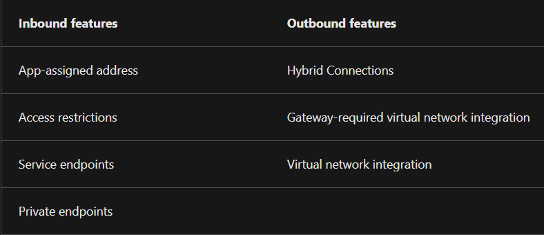

##### Study:
* App Service
* Content Delivery Networks
* Azure DNS

##### Assignment:
* Azure Files
	* What is this used for?
		* I solved this by building theoretical knowledge.
	* How do I use it?
		* I followed a tutorial on MS Learn to learn how to use this resource effectively.
	* How do I combine this with other resources?
		* I learned how to mount the file share to a VM.
* Azure Database (+ managed instance)
	* What is this used for?
		* I solved this by building theoretical knowledge.
	* How do I use it?
		* I followed a tutorial on MS Learn to learn how to set up an Azure SQL Database.
	* How do I combine this with other resources?
		* This requires a depth of knowledge that would require time in excess of the assignment, such as building an application.

#### Azure App Service
Azure App Service is at its core a HTTP-based service for hosting web applications, REST APIs and mobile back ends. It supports multiple programming languages and both Windows and Linux environments. Key features include:
* **Autoscaling support.**
* **Continuous integration/deployment support:** App Service features integration and deployment with Azure DevOps Services, GitHub, BitBucket, FTP or local Git repositories. This allows App Service to auto-sync code once connected to a source.
* **Deployment slots:** on the Standard App Service Plan, one can deploy web apps to a separate deployment slot instead of the default production slot.
* **Built-in authentication and authorisation support:** App Service supports multiple third-party identity providers, such as Google and Facebook logins.

##### Azure App Service plans
App Service plans define the compute resources that an app requires to run. Upon creation, one selects a region and compute resources are created for the plan. Plans define the OS, region, the number and size of VM instances, and the pricing tier. The pricing tiers are:
* **Shared compute:** On the Free and Shared tiers one runs apps on the same VMs as other App Service apps, including those of other customers. This tier does not scale out.
* **Dedicated compute:** This includes the Basic, Standard, and various Premium tiers. These run on dedicated VMs and only apps on the same plan share these resources. The tier of the plan informs how much the app can scale out.
* **Isolated:** The two Isolated tiers allow one to run dedicated VMs on dedicated VNets. This provides network isolation, compute isolation and the most opportunity to scale out.

##### App Service networking
App Service is a distributed system. This means that different roles handle different tasks. *Front ends* handle incoming HTTP or HTTPS requests. The roles that handle customer workloads are named *workers.* Because App Service scale units host a variety of customers, they cannot be connected directly to a network. Instead, App Service supports a number of features to handle these functions.

##### REST API
REST stands for 'representational state transfer.' A RESTful API is an API that follows a set of architectural constraints. It needs to conform to the following parameters:
* A client-server architecture that manages requests through HTTP.
* Stateless client-server communication, which means that no client information is stored between requests.
* Cacheable data.
* A uniform interface that ensures information is transmitted in a standard manner.
* A layered system that organises servers and requested information into hierarchies.

#### Azure Content Delivery Network
Azure CDN is a service that places content closer to clients attempting to access it across the world. It does this by caching data that is accessed on servers closer to the client. These locations are also known as a POP. CDNs are ideal for static content that is accessed by users worldwide. They have little benefit for dynamic or streamed content, or applications that only service users from a strict geographic area. Azure CDN is also capable of compression.

##### Point-of-presence
POP refers to server locations that host content repositories.

#### Azure DNS
Azure DNS is an alternative to an on-premises DNS server or a DNS registrar. It supports multiple file formats, can be integrated and managed with common Azure tools, and supports public and private zoning, which allows specific DNS records to be limited to private networks. Because of its integration with Azure management tools, Azure DNS can be more efficient than using an external DNS registrar with its own tools.

Managing one's own DNS server is a better option if one requires Active Directory Domain Services or support for DNSSEC.

#### Azure Files
See also: [Storage Accounts.](../../04_Azure_1/04_completed_assignments/AZ-05_storageAccounts.md) Azure Files offers a filesharing system with true directory capabilities. Connections to Azure Files from another machine can be made via a PowerShell script in Windows, connecting via a mount point in Linux or the terminal in macOS. 

##### Assignment:
* Create a Storage Account
* Create a file directory and upload a file.
* Connect the directory to a Windows Server VM.
* Check to see if the file can be edited.
* See if the edited file can be downloaded onto a local machine.

To start, I created a Storage Account resource using the Azure Portal. Within the Storage Account, I created a fileshare. I created two directories and uploaded a file. Next, I created a Windows Server VM and used RDP to access it. With a script found in the *connect* link of the fileshare in the Azure Portal, I connected the fileshare to the VM. I was able to view the file I had uploaded and create a new text file. This file was subsequently visible in Azure Storage Explorer on my local machine.

Best practice would include learning Azure User Directory and using this to grant permissions instead of using a sudo key to access the file share.

#### Azure Database
Azure Database options feature the typical cloud advantages, such as availability and scalability. Many of the databases listed below feature point-in-time-restorations up to 35 days and SLAs with 99.99% uptime agreements. Existing databases can be migrated using the Azure Database Migration Service. These are all managed services.

##### Database terminology
* **Table:** Made up of rows and columns.
* **Primary key:** a unique identifier for a row in a relational database table.
* **Foreign key:** a primary key from one table used in another to form a link and relationship with other tables.
* **Collation:** Sorting rules, case and accent sensitivity properties for data.
* **Non-relational databases:** 

##### Azure Cosmos DB
Cosmos DB is a globally distributed, multi-model database service. It works across Azure regions and supports many APIs and SLAs. It stores data in ARS (atom-record-sequence) format. This data is then abstracted and projected with an API, with your choices including SQL, MongoDB, Cassandra, Tables, and Gremlin. This ensures flexibility. It supports schemaless, non-relational data.

##### Azure SQL Database
Azure SQL Database functions as a PaaS database service. It is capable of processing both relational and non-relational data, such as graphs, JSON, spatial, and XML. 

##### Azure Database for MySQL
Azure Database for MySQL is a relational dabase service based on the MySQL Community Edition engine. Several service tiers exist, each offering different performance and capabilities. It is ideal for LAMP (Linux, Apache, MySQL, PHP) solutions.

##### Azure Database for PostgreSQL
Azure Database for PostgreSQL is a relational database service based on the community version of the open-source PostgreSQL engine. It is available in two deployment options:
* **Single Server:**
	* Vertical scaling
	* Pay-as-you-go pricing.
	* Other cloud benefits.
* **Hyperscale (Citus):**
	* Hyperscale (Citus) allows for queries to be scaled horizontally via the use of sharding. 
	* By allowing for parallel processing of incoming SQL queries across multiple servers it is ideal for large datasets of 100GB or more.
	* It supports multi-tenant applications, real-time analytics and high-throughput workloads.

##### Azure SQL Managed Instance
Azure SQL Managed Instance is a PaaS database engine. Similar in many ways to Azure SQL Database, it [features differences](https://learn.microsoft.com/en-us/azure/azure-sql/database/features-comparison?view=azuresql)such as support for Cyrillic characters for collation. It sits in one's VNet.

##### Data Analytics
Azure has many options for data analytics, including:
* **Azure Synapse Analytics:** This allows one to query data using serverless or provisioned resources. Ideal for business intelligence or machine learning.
* **Azure HDInsight:** This is an open-source analytics service. It supports popular open-source frameworks, and can be used for things such as data extraction and transformation.
* **Azure Databricks:** This supports multiple programming languages and data science frameworks in order to develop insights from data and create AI solutions.
* **Azure Data Lake Analytics:** This is an analytics job service that can simplify big data via the use of queries. It is capable of handling queries of any scale by manually setting its power needs.

Thisisatest123!

[Intro to Azure CDN](https://learn.microsoft.com/en-us/training/modules/intro-to-azure-content-delivery-network/)  
[Explore Azure App Service](https://learn.microsoft.com/en-us/training/modules/introduction-to-azure-app-service/)  
[What is a REST API](https://www.redhat.com/en/topics/api/what-is-a-rest-api)  
[Intro to Azure DNS](https://learn.microsoft.com/en-us/training/modules/intro-to-azure-dns/)  
[Intro to Azure Files](https://learn.microsoft.com/en-us/training/modules/introduction-to-azure-files/)  
[Database basics](https://www.lido.app/post/database-101)  
[Azure Database fundamentals](https://learn.microsoft.com/en-us/training/modules/azure-database-fundamentals/)  
[Benefits and Usage of Storage Account Resources - John Savill](https://www.youtube.com/watch?v=b8BrfsxLSx8)  
[Benefits and Usage of Database Resources - John Savill](https://www.youtube.com/watch?v=4sQOF9fSOAU)  
