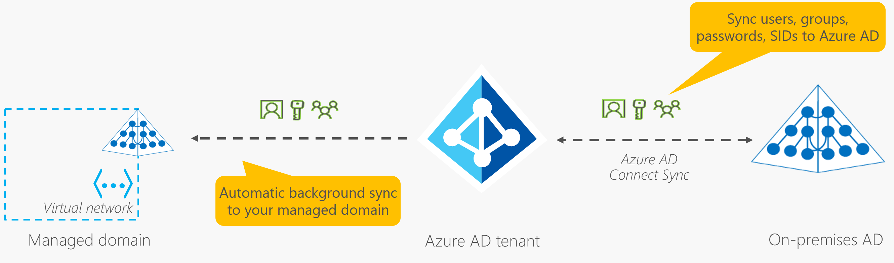

[Describe Azure Identity and Access Security](https://learn.microsoft.com/en-us/training/modules/describe-azure-identity-access-security/)  

#### Azure Active Directory
Azure Active Directory is a centralised identity and access management platform. It can interface with other Azure services, Office 365, 3rd party SaaS solutions and even custom apps. In this way, it acts as an identity provider and gives end-users a single-sign on (SSO): one account and password for multiple applications.

Azure AD supports self-service password resets, MFA, a banned password list and smart lockout services. It also support device registration through tools like MS InTune, offering device-based conditional access policies. It can be connected to an on-premises Active Directory through Azure AD Connect.

##### Azure Active Directory Domain Services
Azure AD DS offers managed domain services such as domain join, group policies, LDAP, and Kerberos or NLTM authentication. This allows one to use applications that do not support modern authentication protocols in the cloud. Azure AD DS integrates with Azure AD, allowing users to access resources tied to AD DS with their SSO.

#### Passwordless Authentication options
Azure and Azure Government features three passwordless authentication options that integrate with Azure AD:

* **Windows Hello for Business:** This ties biometric and PIN credentials directly to a user's PC.
* **MS Authenticator:** This uses an employee's phone as a "something you have" authentication tool, combined with PIn or biometric data.
* **FIDO2 security keys:** Fast IDentity Online is an open standard for passwordless authentication. Typically, sign-in involves something such as a USB device, Bluetooth or NFC communication.

#### External Identities
